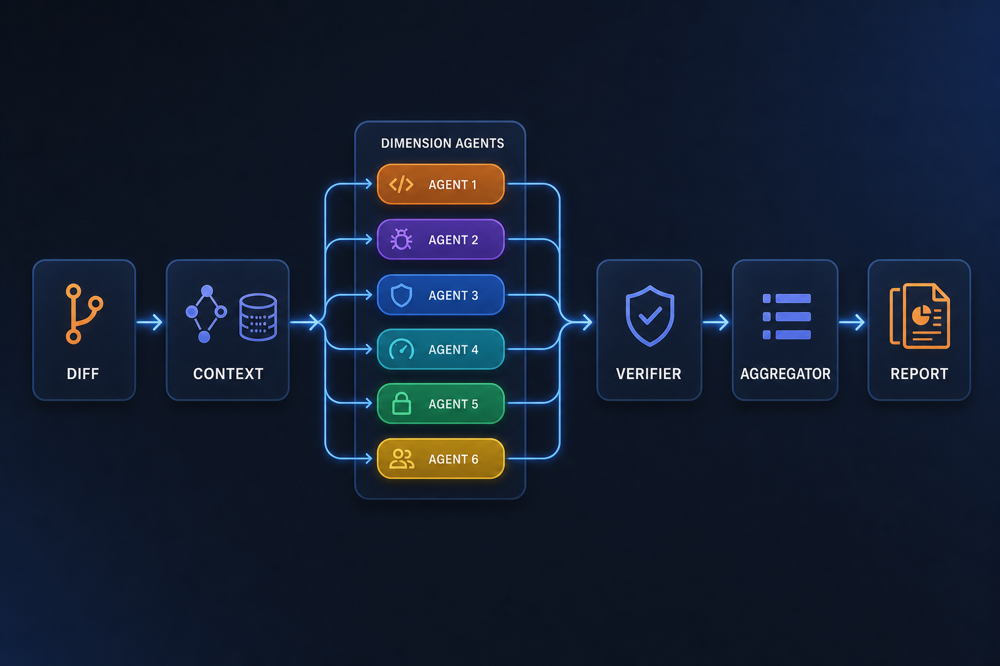
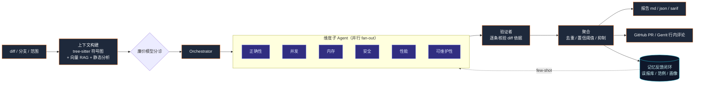

<div align="center">


<p>

<strong>面向 C++/系统代码的自主 AI 代码审查 Agent · 多语言支持</strong><br/>
<em>An autonomous AI code-review agent for C++ / systems code, with multi-language support.</em>

</p>

<p>

[](./LICENSE)
[](https://nodejs.org/)
[](https://www.typescriptlang.org/)
[](https://sarifweb.azurewebsites.net/)
[](#-评测结果可复现)

</p>

<h4>

[快速开始](#-快速开始) · [CI / GitHub Actions](#ci-github-actions) · [核心特性](#-核心特性) · [系统架构](#-系统架构) · [评测结果](#-评测结果可复现) · [文档](#-文档) · [路线图](#-路线图)

</h4>

</div>

---

## 📕 目录

- [💡 ReviewForge 是什么](#-reviewforge-是什么)
- [✨ 核心特性](#-核心特性)
- [🔎 系统架构](#-系统架构)
- [🚀 快速开始](#-快速开始)
- [CI / GitHub Actions](#ci-github-actions)
- [🧰 CLI 命令速查](#-cli-命令速查)
- [🔧 配置](#-配置)
- [📊 评测结果（可复现）](#-评测结果可复现)
- [📚 文档](#-文档)
- [📜 路线图](#-路线图)
- [🤝 贡献](#-贡献)
- [📄 许可证](#-许可证)

---

## 💡 ReviewForge 是什么

**ReviewForge** 是一个命令行 AI 代码审查 Agent。给它一个 **diff / 分支 / 提交范围**，它会：

1. 结合**整个代码库的上下文**（tree-sitter 符号图 + 可选向量 RAG）、**项目规范**与**静态分析信号**（clang-tidy / ruff / eslint / go vet）自动拼装审查证据；
2. 由**多个维度子 Agent 并行**审查（正确性 / 并发 / 内存 / 安全 / 性能 / 可维护性）；
3. 用**验证者**在聚合前对每条结论做 **diff 依据复核**，压制幻觉与越界误报；
4. 输出带行号、严重级别、置信度与修复建议的**结构化报告**（Markdown / JSON / SARIF），并能作为 **CI 门禁**或回贴到 **GitHub PR / Gerrit**。

它专精 **C++/系统代码**（内存、并发、ABI、UB 等深坑），同时原生覆盖 **C / C++ / TypeScript / Python / Go / Rust / Java** 等语言的审查路径。

> **为什么需要它？** 静态分析器（clang-tidy）精确但噪声大、不懂语义；通用 LLM 审查懂意图却只看 diff、易幻觉。ReviewForge 把两者**融合**，锚定在全仓库上下文之上，并配套**可量化评测**——行业对标 CodeRabbit、Cursor Bugbot、Greptile、Copilot Code Review。

**状态：可运行。** 已实现 M1（多维审查）+ M2（评测与记忆闭环）+ M3（平台对接与 CI），并完成质量、性能与生产化增强。

---

## ✨ 核心特性

### 🧠 「双脑」融合：LLM 推理 × 确定性静态分析

- LLM 负责语义理解与跨调用链推理，clang-tidy / ruff / eslint / go vet 提供**事实锚点**。
- 静态分析命中只取**改动行附近**信号，交叉印证、降幻觉、补盲区；工具链缺失时自动降级为纯 LLM + RAG。

### 🕸️ 全仓库上下文：符号图 + 向量 RAG

- tree-sitter 多语言解析，抽取**符号 + 调用关系（callers / callees）**；启发式 C++ 解析作 fallback。
- 索引可在**无 API key** 时构建（仅符号图 + 关键词检索）；配置 `EMBED_*` 后启用 `semantic_search` 语义检索。

### 🧩 手写状态图编排（LangGraph 风格，零框架依赖）

- 节点 + 类型化共享状态 + reducer + 条件路由 + **并行扇入扇出** + checkpoint + 节点级错误隔离。
- 6 个维度子 Agent 并行 fan-out，结果经 reducer 扇入 Aggregator —— 审查天然是 map-reduce 图。

### 🔬 验证者子 Agent：误报的主控制阀

- 聚合前对每条候选 finding 做「假设 → 用 diff 二次核验」，无据则丢弃 / 降置信。

### 🧷 三层记忆，越用越准

- **工作记忆**（单次推理）· **运行 checkpoint**（可中断续跑 / 回放）· **跨次反馈闭环**：
  误报指纹库（自动抑制）+ 已确认 bug 范例库（few-shot）+ 仓库画像（高发缺陷热点）。

### 🏭 生产化 & 可观测

- Provider 指数退避重试 + **fallback 链**、JSON 修复重试、增量索引、磁盘响应缓存、廉价模型分诊。
- `.reviewforge.json` 配置、approve/request-changes 决策、**SARIF 2.1.0** 输出、退出码门禁、自身 CI。
- trace 落盘 + 自带 Chart.js 看板；OpenAI 兼容 provider 抽象（可切 Ollama 离线 / 内网网关）。

---

## 🔎 系统架构

<div align="center">



</div>

审查流水线分两条主路径：

- **索引时（离线、增量）：** 仓库源码 → tree-sitter 解析 → 按符号分块 → 嵌入 → 向量索引 + 符号图。
- **审查时（在线）：** diff → 切 hunk、映射改动符号 → 上下文构建（RAG + 符号图 + 静态分析 + 规范）→ **状态图**执行（Orchestrator 扇出 → 维度子 Agent 并行 → 验证者 → Aggregator 扇入）→ 输出 md/json/sarif + 门禁；过程中读写三层记忆。

<details>
<summary><strong>展开：完整数据流图（Mermaid）</strong></summary>



</details>

更细的模块划分、ADR 与工具清单见 [**架构设计文档**](./docs/ARCHITECTURE.md)。

---

## 🚀 快速开始

### 📝 环境要求

| 必需 | 可选（增强能力） |
|---|---|
| **Node.js** ≥ 18 | `compile_commands.json` + `.clang-tidy`（C++ 深度静态分析） |
| **Git** 与待审查的本地仓库 | 嵌入模型配置 `EMBED_*`（启用语义检索） |
| 可用的 LLM provider（OpenAI 兼容 / Ollama / 内网网关） | ruff / eslint / go vet（对应语言静态分析） |

### ⚙️ 安装与自检

```bash
# 1. 安装依赖（如在公司网络，npm 需走系统代理）
npm install

# 2. 让 rf / reviewforge 命令全局可用
npm link        # 或 npm install -g .

# 3. 配置 provider
cp .env.example .env   # 填入 LLM_BASE_URL / LLM_API_KEY / LLM_MODEL（及可选 EMBED_*）

# 4. 自检
rf doctor
```

### ▶️ 第一次审查

```bash
# 1. 在目标仓库下构建索引
cd /path/to/your/repo && rf index

# 2. 审查当前分支相对 main 的改动
rf review --base main
```

> 索引可在**无对话 API key** 时构建；`review` / `eval` 需要可用的对话 provider。
> 误报抑制支持仓库根目录的 `.rfignore`（文件 glob）。在 CI 中跑审查见下节 [CI / GitHub Actions](#ci-github-actions)。

---

## CI / GitHub Actions

### 本仓库（开发）CI

[`.github/workflows/ci.yml`](./.github/workflows/ci.yml)：`push` 到 `main` 与所有 `pull_request` 触发；执行 `npm ci`、`npm run typecheck`、`npm test`。产物为 Actions 日志与通过/失败状态，无额外上传制品。

### 在「被审查的业务仓库」里用 GitHub Actions

官方示例 workflow：[`examples/github-actions/reviewforge.yml`](./examples/github-actions/reviewforge.yml)。将其复制到业务仓库的 `.github/workflows/`（可按需改名）后，注意下列事项。

| 项 | 说明 |
|---|---|
| **触发条件** | `pull_request`，且 `types: [opened, synchronize, reopened]`（新建 PR、推送更新、重新打开时跑）。 |
| **检出深度** | `actions/checkout` 建议 `fetch-depth: 0`，保证与 `--base` 的 diff 与本地 `git` 行为一致。 |
| **权限** | `contents: read`；若使用 `--post github` 回贴行内评论，需 `pull-requests: write`。 |
| **占位符 `your-org`** | 「Clone ReviewForge」步骤中的 `https://github.com/your-org/reviewforge.git` **必须**改为你实际使用的 fork、镜像或上游地址；生产环境建议固定 **tag / commit SHA**，避免默认分支漂移破坏构建。 |
| **Secrets（敏感）** | **`LLM_API_KEY`**（必填，对话模型）。可选：`EMBED_API_KEY`（启用语义检索时）。`GITHUB_TOKEN` 由 Actions 注入，模板里用 `secrets.GITHUB_TOKEN` 即可。 |
| **Variables（非敏感，可覆盖默认）** | `LLM_BASE_URL`、`LLM_MODEL`、`EMBED_BASE_URL`、`EMBED_MODEL` 等；未设置时模板内对 OpenAI 兼容默认值生效（见 YAML 注释）。 |

**示例 workflow 的产物与行为**

- **`review-out/`**：`--format all` 生成 Markdown、JSON、SARIF 等报告文件。
- **SARIF**：`github/codeql-action/upload-sarif` 上传 `review-out/review.sarif`（步骤带 `if: always()` 与 `continue-on-error: true`，上传失败不一定阻断流水线）。
- **Artifact**：`actions/upload-artifact` 打包 `review-out`，在 Actions 界面下载（artifact 名示例：`reviewforge-report`）。
- **PR 评论**：`--post github` 在 PR 上发审查评论。
- **门禁**：示例为 `--fail-on critical`，超过阈值的 finding 会使 job **非零退出**、标红；可按需改为 `high` / `medium` 或去掉该参数。

### GitLab、Gerrit 与自建私有 CI

ReviewForge 为 **CLI + 环境变量**，不绑定 GitHub Actions：在 **GitLab CI**、**Jenkins**、**Gerrit 触发的 job** 等环境中，用同样思路执行 `index` → `review`、保存制品即可。

- **Gerrit**：内置 `--post gerrit` 与 `GERRIT_*` 环境变量（见 [`.env.example`](./.env.example)），Runner 能访问 Gerrit HTTP API 即可回贴。
- **GitLab**：当前无专用 `gitlab` 行内回贴 sink；可用 **`--format all --out`** 产出报告并作为 **CI 制品**，或自行对接 GitLab API / 平台支持的 SARIF、代码质量报告格式。

---

## 🧰 CLI 命令速查

| 命令 | 作用 |
|---|---|
| `rf index` | 在当前仓库构建/增量更新索引（符号图 + 可选向量） |
| `rf review --base main` | 审查当前分支相对 `main` 的改动 |
| `rf review --commits HEAD~3..HEAD` | 审查指定提交范围 |
| `rf review --diff fix.patch` | 审查一个 patch 文件 |
| `rf review --only concurrency,memory` | 只跑指定维度 |
| `rf review --fail-on high --format all --out review-out` | CI 门禁 + 多格式输出（md/json/sarif） |
| `rf review --base main --dry-run --out dry-out` | 不调 LLM，验证管线 / 导出各维度 prompt |
| `rf feedback <findingId> accept\|reject` | 反馈闭环：确认真 bug（存范例）/ 标记误报（后续抑制） |
| `rf eval --dir benchmarks/cases --configs all --out benchmarks/results` | 评测 + 消融实验 |
| `rf review --base main --post github --pr 42` | 一步审查并回贴 GitHub PR 行内评论 |
| `rf review --base main --post gerrit --change 12345` | 回贴 Gerrit change |
| `rf post --post github --pr 42` | 复用上次 `last-review.json` 重贴 |
| `rf doctor` | 环境与配置自检 |

```bash
# 从真实 fix 提交一键生成基准 case（无需手写 ground truth）
tsx scripts/seed-from-commit.ts /path/to/repo <fix-sha> --id my-case --category concurrency
```

---

## 🔧 配置

通过环境变量（`.env`）或仓库根目录的 `.reviewforge.json` 配置：

| 项 | 说明 |
|---|---|
| `LLM_BASE_URL` / `LLM_API_KEY` / `LLM_MODEL` | 对话 provider（OpenAI 兼容）。可指向 OpenAI / 内网网关 / Ollama |
| `EMBED_BASE_URL` / `EMBED_API_KEY` / `EMBED_MODEL` | 嵌入 provider（配置后启用 `semantic_search`） |
| `RF_CACHE` | 响应缓存开关（`0` 关闭，用于测真实方差） |
| `.reviewforge.json` | 维度开关、置信阈值、忽略规则、语言映射、分析器路径 |
| `.rfignore` | 文件 glob 级别的误报/范围抑制 |

---

## 📊 评测结果（可复现）

> 完整流水线（tree-sitter + 验证者 + 分诊 + 多语言静态分析）在 **10 个公开 case**
> （spdlog C/C++ ×4、tidwall/gjson Go ×4、negative/clean ×2）上的消融。
> 指标按 **缺陷组级别 + category-agnostic** 的 reviewer 口径统计，用本工具自带的
> `aggregateMetrics` 重算，**可从公开仓库完全复现**。

**v2（10 个公开 case）**

| Config | Recall | Precision | F1 | FP/case | Localization |
|---|---|---|---|---|---|
| B-llm-only | 40.0% | 100% | 57.1% | 0.00 | 100% |
| **+rag / full** | **60.0%** | **100%** | **75.0%** | **0.00** | 100% |

**v3（10 个公开 case，复跑）**

| Config | Recall | Precision | F1 | FP/case | Localization |
|---|---|---|---|---|---|
| B-llm-only | 40.0% | 80% | 53.3% | 0.10 | 100% |
| **+rag / full** | **50.0%** | **100%** | **66.7%** | **0.00** | 100% |

- **RAG 提升 recall**（v2 40→60%、v3 40→50%），并保持 **100% 精确率 / 近 0 误报**、100% 行号定位。
- **诚实口径：** 单次 LLM 运行方差大（实测 recall ±19pt），可靠对比需 `--runs N` 多次取均值并固定缓存策略；单次消融的小差异落在噪声内。

完整表格、原始 JSON、方差实验与复现说明见 [**benchmarks/results-public/**](./benchmarks/results-public/) 与 [**benchmarks/README.md**](./benchmarks/README.md)。内部专有 C++ 历史 case 的数字（Recall 87.5% / F1 82.4% / FP 0.67）仅作定性参考、**不可从本仓库复现**，详见 [docs/WRITEUP.md](./docs/WRITEUP.md) 与 [docs/EVAL_PLAN.md](./docs/EVAL_PLAN.md)。

---

## 📚 文档

| 文档 | 内容 |
|---|---|
| [docs/WRITEUP.md](./docs/WRITEUP.md) | 项目综述（问题 / 架构 / 取舍 / 评测，对外说明向） |
| [docs/PRD.md](./docs/PRD.md) | 产品需求文档（目标用户、功能优先级、里程碑） |
| [docs/ARCHITECTURE.md](./docs/ARCHITECTURE.md) | 架构与状态图设计、ADR、工具清单、数据流 |
| [docs/EVAL_PLAN.md](./docs/EVAL_PLAN.md) | 评测计划与指标口径 |
| [docs/IMPROVEMENTS.md](./docs/IMPROVEMENTS.md) | 改进路线图（P0–P6） |

---

## 📜 路线图

- [x] **M1** 多维审查 MVP（索引 + 上下文 + 状态图编排 + 聚合 + clang-tidy 融合 + md/json + 门禁）
- [x] **M2** 记忆闭环 + 可量化评测（三层记忆 + 评测 harness + 误报抑制 + SARIF）
- [x] **M3** 平台对接（GitHub / Gerrit 回贴、CI 模板、多语言）
- [x] **结构化（function-calling）finding 输出** —— JSON-schema 强约束 + provider 能力探测自动回落 `json_object`（`RF_STRUCTURED_OUTPUT`）
- [x] **置信区间** —— 多轮评测报告/看板按 mean ± 95% CI（Student's t）展示
- [x] **基准集扩容** —— 由 10 扩到 24（新增自包含 synthetic bug + negative，覆盖 C++/Py/Go/TS/Java）；继续向 50 + 真实 seed 推进
- [x] **eval 回归门禁接入 CI** —— `.github/workflows/eval.yml`：定时 + 手动触发，对比公开基线，回归即阻断
- [x] **更丰富的跨文件调用图与类型解析** —— receiver 类型推断 + import 别名归一 + 跨文件 `Type.method` 定义解析；`find_references` / `read_symbol` 支持 `qualifier` 消歧
- [x] **增量 PR-update 审查** —— `rf review --incremental` 仅审上次审查以来新推送的提交
- [x] **托管式 tracing** —— 可配 `RF_TRACE_ENDPOINT` 将每次审查 trace POST 到自有收集器（厂商中立 JSON，不绑定 LangSmith）
- [ ] 基准集继续扩到 50 + 真实 seed 历史缺陷

详见 [docs/IMPROVEMENTS.md](./docs/IMPROVEMENTS.md)。

---

## 🤝 贡献

欢迎 issue 与 PR。开发相关命令：

```bash
npm run typecheck   # tsc --noEmit
npm test            # vitest
npm run build       # 编译到 dist/
```

技术栈：TypeScript / Node（ESM）· tree-sitter · 本地向量检索与符号图 · 手写状态图编排 · clang-tidy / ruff / eslint / go vet 融合 · SARIF 输出 + 退出码门禁。

---

## 📄 许可证

本项目以 [MIT License](./LICENSE) 开源。
