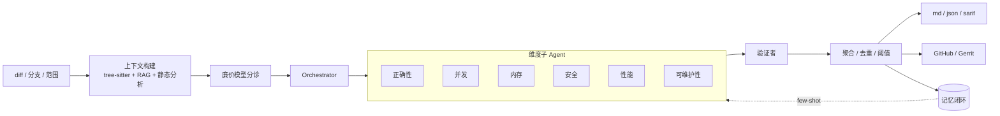

# ReviewForge

**AI 代码审查 Agent（面向 C++/系统代码，多语言）** · *AI code review agent for C++/systems code with multi-language support*

[](./LICENSE)
[](https://nodejs.org/)

给仓库一个 **diff / 分支 / 提交范围**，ReviewForge 会结合 **代码库上下文**（tree-sitter 符号图 + 可选向量 RAG）、**项目规范** 与 **静态分析**（clang-tidy / ruff / eslint / go vet），通过 **多维度子 Agent + 验证者** 输出带行号、严重级别、置信度与修复建议的结构化审查结果（Markdown / JSON / SARIF），并支持 **CI 门禁** 与 **GitHub PR / Gerrit** 行内回贴。

**状态：可运行。** 已实现 M1（多维审查）+ M2（评测与记忆闭环）+ M3（平台对接与 CI），并完成质量、性能与生产化相关增强。

---

## 目录

- [ReviewForge 是什么](#reviewforge-是什么)
- [快速开始](#快速开始)
- [核心能力](#核心能力)
- [架构一览](#架构一览)
- [文档](#文档)
- [评测与可复现结果](#评测与可复现结果)
- [技术栈](#技术栈)
- [许可证](#许可证)

---

## ReviewForge 是什么

ReviewForge 是一套 **可本地运行的 CLI 审查流水线**：在改动周围自动拼装「符号 + 检索 + 静态分析」证据，由多个专职维度的审查子 Agent 并行分析，再由验证者在聚合前对每条 finding 做 **diff 依据复核**，从而降低幻觉与越界误报。专精 **C++/系统代码**（内存、并发、ABI、UB 等），同时原生覆盖 **C / C++ / TypeScript / Python / Go / Rust / Java** 等语言的审查路径。

**行业对标：** CodeRabbit、Cursor Bugbot、Greptile、Copilot Code Review 一类产品；本仓库强调 **可量化评测**（基准集 + 消融）与 **LLM × 静态分析 × RAG** 的融合，而非单一聊天式点评。

---

## 快速开始

### 环境要求

- **Node.js** ≥ 18  
- **Git** 与待审查的本地仓库  
- **可选：** `compile_commands.json`、`.clang-tidy`（启用 clang-tidy 深度融合）、嵌入模型配置（启用语义检索）

### 安装与自检

```bash
npm install
npm link          # 或 npm install -g .

cp .env.example .env   # 配置 LLM_BASE_URL / LLM_API_KEY / LLM_MODEL（可选 EMBED_*）

rf doctor
```

### 常用命令

```bash
# 在目标仓库下构建索引（无 API key 时可构建符号与关键词索引；配置 EMBED_* 后启用 semantic_search）
cd /path/to/your/repo && rf index

# 相对 main 审查当前分支
rf review --base main

# 更多入口
rf review --commits HEAD~3..HEAD
rf review --diff fix.patch
rf review --only concurrency,memory
rf review --fail-on high --format all --out review-out

# 反馈闭环（误报抑制 / 已确认 bug 范例）
rf feedback <findingId> accept
rf feedback <findingId> reject

# 评测
rf eval --dir benchmarks/cases --configs all --out benchmarks/results

# 从真实 fix 提交生成基准 case
tsx scripts/seed-from-commit.ts /path/to/repo <fix-sha> --id my-case --category concurrency

# 不调 LLM 验证管线 / 导出 prompt
rf review --base main --dry-run --out dry-out

# 回贴 PR / Gerrit
rf review --base main --post github --pr 42
rf review --base main --post gerrit --change 12345
rf post --post github --pr 42
```

**CI 示例：** [`examples/github-actions/reviewforge.yml`](./examples/github-actions/reviewforge.yml)

**说明：** 索引可在无对话 API key 时完成；`review` / `eval` 需要可用的 LLM provider。误报抑制支持仓库根目录 `.rfignore`（文件 glob）。

---

## 核心能力

| 方向 | 说明 |
|------|------|
| **编排** | 手写有状态图（LangGraph 风格）：节点、类型化共享状态、reducer、条件路由、并行扇入扇出、checkpoint、节点级错误隔离 |
| **解析与上下文** | tree-sitter 多语言符号 + 调用关系；启发式 C++ 解析 fallback；可选向量 RAG |
| **验证者** | 聚合前对每条 finding 用 diff 二次核验，压幻觉 |
| **记忆** | 工作记忆 / 运行 checkpoint / 跨次反馈（误报库、已确认 bug few-shot、仓库画像） |
| **静态分析** | clang-tidy、ruff、eslint、go vet，聚焦改动附近信号 |
| **工程化** | Provider 重试与 fallback、JSON 修复重试、增量索引、响应缓存、`.reviewforge.json`、SARIF、退出码门禁、trace + Chart.js 看板 |
| **Provider** | OpenAI 兼容抽象（Ollama / 内网网关等） |

**语言支持简述：** C/C++ 带启发式符号与 clang-tidy；Rust / Go / Python 等按文件分块，走 LLM + RAG 审查路径（详见架构文档）。

---

## 架构一览



更细的模块划分与工具列表见 [**架构设计**](./docs/ARCHITECTURE.md)。

---

## 文档

| 文档 | 内容 |
|------|------|
| [docs/WRITEUP.md](./docs/WRITEUP.md) | 项目综述（对外说明 / 简历向） |
| [docs/PRD.md](./docs/PRD.md) | 产品需求 |
| [docs/ARCHITECTURE.md](./docs/ARCHITECTURE.md) | 架构与状态图设计 |
| [docs/EVAL_PLAN.md](./docs/EVAL_PLAN.md) | 评测计划与指标口径 |
| [docs/IMPROVEMENTS.md](./docs/IMPROVEMENTS.md) | 改进路线图 |

---

## 评测与可复现结果

公开子集在 **10 个 case**（spdlog C/C++ ×4、tidwall/gjson Go ×4、negative/clean ×2）上对比 **纯 LLM** 与 **+RAG / full** 配置；指标按 **缺陷组级别、与类别无关** 的 reviewer 口径统计，可用仓库内工具复算。

**结论摘要（公开子集）：** RAG 在控制误报的前提下提升 recall；单次跑动方差大，对比应多次取均值并固定缓存策略。完整表格、原始 JSON 与复现说明见 [**benchmarks/results-public/**](./benchmarks/results-public/) 与 [**benchmarks/README.md**](./benchmarks/README.md)。

内部专有 C++ 历史 case 的数字仅作定性参考，**不可从本仓库复现**；详细叙述仍保留在 [docs/WRITEUP.md](./docs/WRITEUP.md) 与评测计划中，避免在首页 README 重复长表。

---

## 技术栈

TypeScript / Node（ESM）· tree-sitter · 本地向量检索与符号图 · 手写状态图编排 · clang-tidy 融合 · SARIF / CI

---

## 许可证

[MIT License](./LICENSE)
