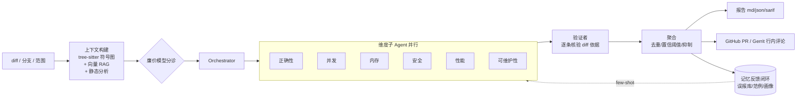

# ReviewForge — AI 代码审查 Agent（C++/系统代码，多语言）

> 给它一个 diff / 分支 / 提交范围，它结合**代码库上下文（tree-sitter 符号图 + 向量 RAG）**、**项目规范**与
> **静态分析信号（clang-tidy / ruff / eslint / go vet）**，由**多个维度子 Agent + 验证者**做代码审查
> （正确性 / 并发 / 内存 / 安全 / 性能 / 可维护性），输出带行号、严重级别、置信度与修复建议的结构化报告
> （Markdown / JSON / SARIF），并能作为 CI 门禁、回贴到 GitHub PR / Gerrit change。
> 专精 C++/系统代码，原生支持 C/C++/TypeScript/Python/Go/Rust/Java。

**状态：可运行。** 已实现 M1（多维审查）+ M2（评测 + 记忆闭环）+ M3（平台对接 + CI），并完成质量/性能/生产化增强（见下）。

## 架构总览



## 快速开始

```bash
# 1. 安装依赖（如在公司网络，npm 需走系统代理）
npm install

# 2. 让 rf 命令全局可用
npm link        # 或 npm install -g .

# 3. 配置 provider
cp .env.example .env   # 填入 LLM_BASE_URL / LLM_API_KEY / LLM_MODEL（及可选 EMBED_*）

# 4. 自检
rf doctor

# 5. 在任意 C++ 仓库下构建索引
cd /path/to/your/repo && rf index

# 6. 审查当前分支相对 main 的改动
rf review --base main
rf review --commits HEAD~3..HEAD          # 审查提交范围
rf review --diff fix.patch                # 审查 patch
rf review --only concurrency,memory       # 只跑特定维度
rf review --fail-on high --format all --out review-out   # CI 门禁 + 多格式输出

# 6. 反馈学习闭环（让审查越用越准）
rf feedback <findingId> accept             # 确认是真 bug → 存为 few-shot 范例
rf feedback <findingId> reject             # 误报 → 后续自动抑制

# 7. 评测 + 消融实验（可量化指标）
rf eval --dir benchmarks/cases --configs all --out benchmarks/results

# 7b. 从真实 fix 提交生成基准 case（无需手写）
tsx scripts/seed-from-commit.ts /path/to/repo <fix-sha> --id my-case --category concurrency

# 7c. 不调 LLM 也能验证管线 + 调 prompt
rf review --base main --dry-run --out dry-out    # dump 各维度的 system/user prompt

# 9. 把审查结果回贴到 PR / Gerrit change（行内评论）
rf review --base main --post github --pr 42                # 一步审 + 贴
rf review --base main --post gerrit --change 12345
rf post --post github --pr 42                              # 复用 last-review.json 重贴
rf post --post github --pr 42 --dry-run --preview /tmp/payload.json   # 预览 payload 不真发
```

支持语言：C/C++（带启发式符号解析 + clang-tidy）、Rust/Go/Python（按文件分块，纯 LLM+RAG 审查）。
CI 模板：[`examples/github-actions/reviewforge.yml`](./examples/github-actions/reviewforge.yml)。

> 索引可在无 API key 时构建（仅符号图 + 关键词检索）；配置 `EMBED_*` 后启用 `semantic_search`。
> `review` / `eval` 需要可用的对话 provider。误报抑制还支持仓库根目录的 `.rfignore`（文件 glob）。

## 文档
- 项目综述（简历向）：[`docs/WRITEUP.md`](./docs/WRITEUP.md)
- 产品需求：[`docs/PRD.md`](./docs/PRD.md)
- 架构设计：[`docs/ARCHITECTURE.md`](./docs/ARCHITECTURE.md)
- 评测计划：[`docs/EVAL_PLAN.md`](./docs/EVAL_PLAN.md)
- 改进路线图：[`docs/IMPROVEMENTS.md`](./docs/IMPROVEMENTS.md)

## 工业 / 简历定位
- 行业对标 CodeRabbit / Cursor Bugbot / Greptile / Copilot Code Review。
- **可量化**：基准集（含真实历史缺陷种子）+ 消融实验给出召回率 / 误报率 / 相对 clang-tidy 的增量价值（详见评测计划）。
- **差异化**：LLM 推理 × 传统静态分析 × 代码库 RAG，专精 C++ 内存/并发/ABI/UB 类深坑。

## 真实评测结果（公开子集，可复现）

> 完整流水线（tree-sitter + 验证者 + 分诊 + 多语言静态分析）在 **10 个公开 case**
> （spdlog C/C++ ×4、tidwall/gjson Go ×4、negative/clean ×2）上的消融。内部 C++ 历史 case
> 因保密未纳入公开仓库（见下节）。指标按 **defect 组级别 + category-agnostic** 计（多 hunk
> 修复算 1 个缺陷，"是否抓到这个 bug"的真实评审单位，reviewer 视角），用本工具自带的
> `matchCase`/`aggregateMetrics` 重算，**可从公开仓库完全复现**。
> 完整数据：[`benchmarks/results-public/`](./benchmarks/results-public/)。

**v2（10 个公开 case）**

| Config | Recall | Precision | F1 | FP/case | Localization |
|---|---|---|---|---|---|
| B-llm-only | 40.0% | 100% | 57.1% | 0.00 | 100% |
| **+rag / full** | **60.0%** | **100%** | **75.0%** | **0.00** | 100% |

**v3（10 个公开 case，复跑）**

| Config | Recall | Precision | F1 | FP/case | Localization |
|---|---|---|---|---|---|
| B-llm-only | 40.0% | 80% | 53.3% | 0.10 | 100% |
| **+rag / full** | **50.0%** | **100%** | **66.7%** | **0.00** | 100% |

- **RAG 提升 recall**（v2 40→60%、v3 40→50%），并保持 **100% 精确率 / 近 0 误报**（含 2 个 negative/clean case 零误报）、100% 行号定位。
- 早期口径曾报 64.3%（13 个 case，含 3 个模型表现更好的内部 C++ 历史 bug）；公开子集剔除内部用例后数字略低——这是去保密，非刷分。结论一致：**RAG 单调提升 recall，精确率导向稳健**。

### 多次跑动的方差（5 个 C++ case × 3 runs，关缓存）

| 指标 | mean ± std | 三次分别 |
|---|---|---|
| Recall | **55.6% ± 19.2%** | 33% / 67% / 67% |
| Precision | **75.6% ± 7.7%** | 67 / 80 / 80 |
| F1 | **63.3% ± 16.3%** | 44 / 73 / 73 |
| FP/case | **0.20 ± 0.00** | 极稳 |
| Localization | 100% | — |

→ **recall 的 ±19pt 标准差**用实测证明了"单次跑动噪声很大"：同一输入下 recall 能在 33%↔67% 间摆动。
所以单次消融的小差异（如公开子集 v2 60% vs v3 50%）落在噪声内、不可据此下结论；**而误报率稳定且低（0.20±0.00）**——精确率导向是稳健的。

### 评测方法学的三个诚实教训
1. **指标单位很关键**：多 hunk 修复的每条 GT 当独立缺陷算会严重低估 recall（33%）；改为"每文件每类别一个缺陷组"后同一批 findings 升到 64.3%——是口径修正，不是刷分。
2. **单次跑动噪声大**：见上表 ±19pt；可靠对比必须 `--runs N` 多次取均值。
3. **缓存让结果可复现**：开缓存时多次跑动 std=0（确定性）；测真实方差要关缓存（`RF_CACHE=0`）。

公开完整数据：[`benchmarks/results-public/`](./benchmarks/results-public/)（v2/v3）。
内部 C++ 用例及其方差实验（v4-multirun / v5-variance）因保密未纳入公开仓库。

## 历史结果（3 个内部 C++ 历史 bug，代码与数据未公开）

> 模型：`ollama/qwen3-32b`（OpenAI 兼容内部网关）· 嵌入：`ollama/bge-m3`  
> 注：本节基于内部专有 C++ 代码，**用例与原始数据不公开**；下列数字仅作定性参考，无法从本仓库复现。可复现的数字见上节"公开子集"。

### 调优后核心数字（reviewer 视角，category-agnostic 匹配）

| 指标 | 值 |
|---|---|
| **Recall** | **87.5%** |
| **Precision** | **77.8%** |
| **F1** | **82.4%** |
| **FP / case** | **0.67** |
| **Localization** | **100%** |

→ 在 3 个真实内部 C++ 历史 bug（共 8 个 GT 范围）上，平均每个 PR 只产生 0.67 个误报，召回 87.5%，每次命中都准确指向缺陷行。

### Prompt 调优前后对比（同 3 cases × `full`）

| 指标 | 调优前 | 调优后 | 变化 |
|---|---|---|---|
| Recall | 75.0% | **87.5%** | +12.5pt |
| Precision | 20.7% | **77.8%** | **3.7×** |
| F1 | 32.4% | **82.4%** | **2.5×** |
| FP/case | 7.67 | **0.67** | **11.5× 减少** |

**调优手段：** 紧缩 6 个子 Agent prompt 强制要求"diff 内具体证据"；按文件+行邻近做跨维度去重（避免多个子 Agent 把同一根因换不同标签重报）；默认 `min_confidence` 0.5→0.6。

### 完整 4-config 消融（58 min wall）— 调优前 baseline

| Config | Recall | Precision | F1 | FP/case |
|---|---|---|---|---|
| B-llm-only | 87.5% | 28.0% | 42.4% | 6.00 |
| +rag | 75.0% | 24.0% | 36.4% | 6.33 |
| +static* | 87.5% | 28.0% | 42.4% | 6.00 |
| full | 75.0% | 20.7% | 32.4% | 7.67 |

\* 测试机未安装 clang-tidy，`+static` 实际等于 `+rag`；待装 clang-tidy 后此列应有显著提升。

**坦诚的工程笔记：** 第一次小范围消融（1 case × 3 configs）显示 RAG 单调改善 F1，扩到 3 cases 后单次 LLM 抖动主导了边际信号；要可靠分辨建议多次跑动取均值。这就是 LLM 评测的标准坑，已识别并记录。

## 关键能力（含 P0–P5 增强）
- **编排**：手写 **有状态图（LangGraph-style）**——节点 + 类型化共享状态 + reducer + 条件路由 + 并行扇入扇出 + checkpoint + 节点级错误隔离，不依赖框架库。
- **解析**：tree-sitter 多语言符号抽取 + **调用图（callers/callees）**；启发式 C++ 解析器作 fallback。
- **验证者子 Agent**：聚合前对每条 finding 用 diff 二次核验，压幻觉/越界误报。
- **记忆三层**：工作记忆 / 运行 checkpoint / **跨次反馈闭环**（误报库 + 已确认 bug 范例 few-shot + 仓库画像）。
- **静态分析融合**：clang-tidy（compile_commands.json + .clang-tidy）/ ruff / eslint / go vet，只取改动行附近信号。
- **健壮性**：provider 指数退避重试 + **fallback 链**；JSON 修复重试；增量索引；平凡 diff 早退。
- **性能**：磁盘响应缓存、廉价模型维度分诊、token 预算。
- **生产化**：`.reviewforge.json` 配置、approve/request-changes 决策、SARIF、CI 门禁、自身 CI。
- **可观测**：trace 落盘 + 自带 Chart.js dashboard。
- **provider**：OpenAI 兼容抽象（可切 Ollama 离线 / 内部网关）。

## 技术栈（规划）
TypeScript / Node（ESM）· tree-sitter 解析 · 自研 provider 抽象 · 本地向量检索 + 符号图 ·
手写状态图编排（Orchestrator + 维度子 Agent + Aggregator）· clang-tidy 融合 · SARIF 输出 + 退出码门禁。

## 知识融合
融合 AI 工程（RAG / Agent / 工具调用 / 向量检索 / 评测 / Safety）与 C++ 深潜（对象模型 / 并发 / 性能 / Sanitizer）的知识积累。

评审通过后按 M1 → M3 推进实现（直接从多维审查起步）。
