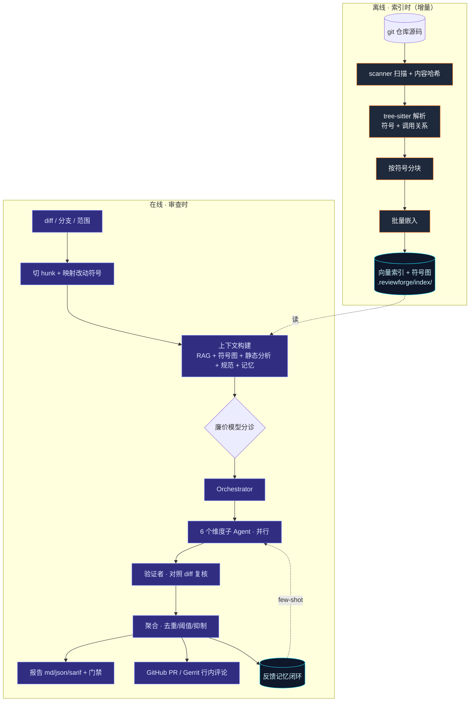

# 第 1 章 · 开篇：ReviewForge 是什么

> 本章建立全书的心智模型：ReviewForge 解决什么问题、整体数据流长什么样、代码目录如何映射到职责，以及后续章节的阅读路线。读完本章，你应当能在脑中画出「diff → 上下文 → 状态图 → 报告」这条主干。

## 1.1 一句话定义

**ReviewForge 是一个命令行 AI 代码审查 Agent。** 给它一个 **diff / 分支 / 提交范围**，它会：

1. 结合**整个代码库的上下文**（tree-sitter 符号图 + 可选向量 RAG）、**项目规范**与**静态分析信号**（clang-tidy / ruff / eslint / go vet）自动拼装审查证据；
2. 由**多个维度子 Agent 并行**审查（正确性 / 并发 / 内存 / 安全 / 性能 / 可维护性）；
3. 用**验证者**在聚合前对每条结论做 **diff 依据复核**，压制幻觉与越界误报；
4. 输出带行号、严重级别、置信度与修复建议的**结构化报告**（Markdown / JSON / SARIF），并能作为 **CI 门禁**或回贴到 **GitHub PR / Gerrit**。

它专精 **C++/系统代码**（内存、并发、ABI、未定义行为等深坑），同时原生覆盖 C / C++ / TypeScript / Python / Go / Rust / Java 的审查路径。

## 1.2 为什么需要它：两类工具的缝隙

| | 优点 | 缺点 |
|---|---|---|
| **静态分析器**（clang-tidy） | 精确、确定性、有规则依据 | 噪声大、不懂语义、不懂业务意图 |
| **通用 LLM 审查** | 懂意图、能跨调用链推理 | 只看 diff、易幻觉、爱挑无关小毛病 |

ReviewForge 的差异化在于把两者**融合**，并锚定在**全仓库上下文**之上：LLM 负责语义理解与推理，静态分析命中作为**结构化事实信号**注入，二者交叉印证——「LLM 解释 + 工具佐证 → 高置信」。当工具链缺失时，系统自动降级为纯 LLM + RAG，**不阻塞**。

这条「双脑融合 + 全仓库上下文 + 可量化评测」的主线，会反复出现在后续每一章里。

## 1.3 整体数据流：两条主路径

ReviewForge 的运行可以清晰地切成**离线**与**在线**两条路径。



- **索引时（离线，增量）**：仓库源码 → tree-sitter 解析 → 按符号分块 → 嵌入 → 向量索引 + 符号图。这一路由 `rf index` 触发，详见[第 4 章](./04-index-pipeline)。
- **审查时（在线）**：diff → 切 hunk、映射改动符号 → 上下文构建 → **审查状态图**执行（Orchestrator 扇出 → 维度子 Agent 并行 → 验证者 → 聚合）→ 输出 + 门禁。这一路由 `rf review` 触发，是[第 5–8 章](./05-review-preprocessing)的主战场。

## 1.4 一张「源码地图」

ReviewForge 约 5k 行 TypeScript（ESM），`src/` 按职责清晰分层。把目录读成「责任田」，后续章节就有了坐标：

```
reviewforge/
├── bin/reviewforge.ts        # CLI 入口（二进制 rf / reviewforge）—— 第 2 章
├── src/
│   ├── cli.ts                # 命令注册 + 各子命令实现 —— 第 2 章
│   ├── config.ts             # 环境变量 + 仓库配置 → Config（zod）—— 第 3 章
│   ├── providers/            # chat / embeddings / cache / fallback / http —— 第 3 章
│   ├── index/                # scanner/parser/treesitter/chunker/
│   │                         #   symbol_graph/imports/indexer/store —— 第 4 章
│   ├── review/               # diff/context_builder/static_analysis/
│   │                         #   guidelines/ignore/incremental/gerrit_change —— 第 5 章
│   ├── agent/                # graph/state/orchestrator/runtime/
│   │                         #   subagents/lang_guidance/aggregator/tools/
│   │                         #   structured/dry_run/trace_export —— 第 6–8 章
│   ├── memory/               # store(长期) / checkpoint(运行) —— 第 9 章
│   ├── report/               # finding/markdown/json/sarif/gate/sinks —— 第 10 章
│   └── eval/                 # bench/runner/judge/metrics/ablation/
│                             #   report/dashboard/regression/seed —— 第 11 章
├── benchmarks/               # 评测基准集（cases + results）—— 第 11 章
└── .reviewforge/             # 运行时数据（索引/记忆/traces/runs），git 忽略
```

## 1.5 七个核心设计抉择（提前剧透）

整个项目由若干贯穿性的工程决策定调，本书会逐一展开。先在这里列出，作为阅读时的「锚」：

1. **手写状态图，不用 LangGraph**——显式实现「agent = 有状态图」范式，运行时仅约 70 行（[第 6 章](./06-state-graph)）。
2. **tree-sitter（WASM）而非 clang AST**——可移植、多语言、无需编译环境，精度不足处由 clang-tidy 补（[第 4 章](./04-index-pipeline)）。
3. **OpenAI 兼容 provider 抽象**——一套代码可指 OpenAI / 内网网关 / Ollama（[第 3 章](./03-config-providers)）。
4. **LLM 与静态分析融合**——确定性信号作为「事实锚点」注入维度子 Agent（[第 5、7 章](./05-review-preprocessing)）。
5. **验证者 + 聚合器双控制阀**——误报抑制的工业生命线（[第 8 章](./08-tools-verifier-aggregator)）。
6. **三层记忆反馈闭环**——让审查随使用越来越准（[第 9 章](./09-memory)）。
7. **可量化、可复现的评测**——用消融与置信区间证明每个组件的增益（[第 11 章](./11-eval)）。

## 1.6 一条「失败即降级」的设计哲学

在通读源码后，你会注意到一个反复出现的模式：**几乎每一处外部依赖都被设计成「失败即降级、不阻塞主流程」**。

- 无嵌入 provider？索引退化为「符号图 + 关键词检索」，`semantic_search` 关闭，但 `rf index` 照常完成。
- 无 clang-tidy？静态分析适配器静默跳过，审查退化为纯 LLM + RAG。
- 某个维度子 Agent 抛异常？状态图把它兜成空结果，**不中断整层**，其他维度照常产出。
- 验证者调用失败？保守地**保留全部 finding**，绝不因为复核环节崩了就丢结论。
- 托管 trace 上报失败？best-effort，记一条日志即返回，审查不受影响。

这种「优雅降级」是把一个 demo 变成**生产级工具**的关键，也是本书会反复强调的看点。

## 1.7 阅读路线

- **想先跑起来**：直接看[第 2 章](./02-cli)的命令生命周期，配合项目根 README 的「快速开始」。
- **想理解 Agent 编排范式**：[第 6 章](./06-state-graph)是全书核心，建议精读。
- **关心检索/RAG**：[第 4 章](./04-index-pipeline)。
- **关心误报治理**：[第 8 章](./08-tools-verifier-aggregator)与[第 9 章](./09-memory)。
- **关心评测严谨性**：[第 11 章](./11-eval)。

下一章，我们从最外层的入口——CLI——开始，看 ReviewForge 是如何把一行 `rf review --base main` 翻译成一整套审查流水线的。
