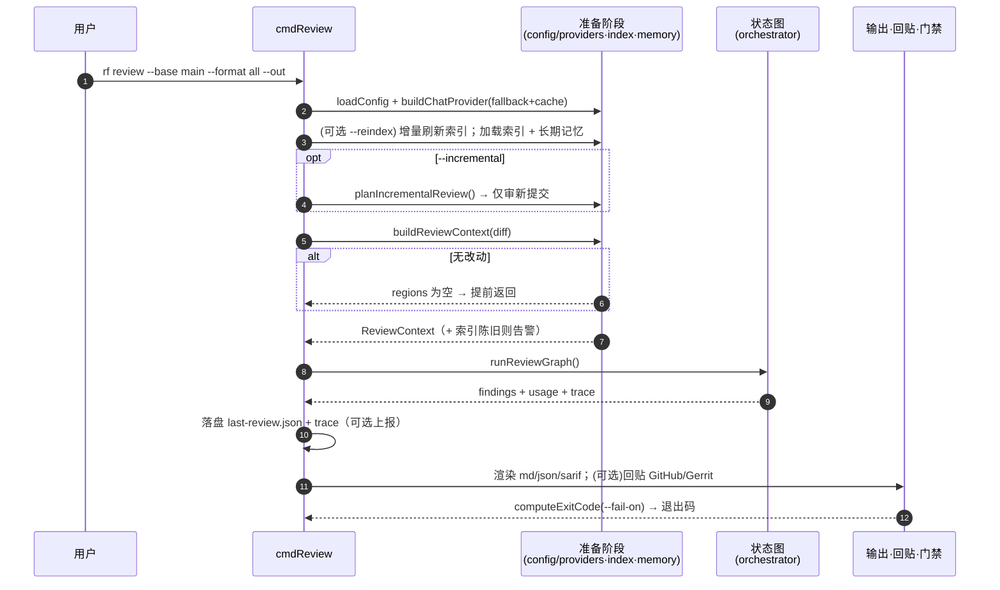

# 第 2 章 · CLI 与命令分发

> 本章拆解最外层的入口：`bin/reviewforge.ts` 与 `src/cli.ts`（约 850 行）。我们会看 `commander` 如何注册全部子命令，并把 `rf review` 的一次完整生命周期当作主线，串起后续所有章节的模块。涉及文件：`src/cli.ts`。

## 2.1 两个二进制名、一个入口

`package.json` 把可执行入口指向 `bin/reviewforge.cjs`，并暴露两个名字——完整名 `reviewforge` 与短别名 `rf`：

```json
"bin": {
  "reviewforge": "bin/reviewforge.cjs",
  "rf": "bin/reviewforge.cjs"
}
```

入口最终调用 `src/cli.ts` 导出的 `run(argv)`。`run` 用 `commander` 的 `Command` 注册所有子命令，然后 `program.parseAsync(argv)` 分发：

```ts
// src/cli.ts · run() 的骨架
const program = new Command();
program.name("reviewforge").description("AI code review agent for C++/systems code").version("0.1.0");

program.command("index")        // 构建/刷新索引
program.command("review")       // 审查 diff/分支/范围
program.command("review-change")// 一键 Gerrit 审查
program.command("post")         // 复用上次结果重贴
program.command("feedback")     // 反馈闭环
program.command("eval")         // 评测 + 消融
program.command("doctor")       // 环境自检

await program.parseAsync(argv);
```

七个子命令，对应七条职责。我们逐一看，但把篇幅重点放在 `review` 上——它是整个系统的主干。

## 2.2 命令全景

| 命令 | 实现函数 | 作用 | 主要涉及章节 |
|---|---|---|---|
| `index` | `cmdIndex` | 构建/增量更新索引（符号图 + 可选向量） | [第 4 章](./04-index-pipeline) |
| `review` | `cmdReview` | 审查 diff/分支/范围，输出报告 + 门禁 | [第 5–8、10 章](./05-review-preprocessing) |
| `review-change` | `cmdReviewChange` | 拉取 Gerrit change → 刷新索引 → 审查 → 回贴 | [第 5、10 章](./05-review-preprocessing) |
| `post` | `cmdPost` | 复用 `last-review.json` 重新贴评论 | [第 10 章](./10-report-sinks) |
| `feedback` | `cmdFeedback` | 把 accept/reject 回流到长期记忆 | [第 9 章](./09-memory) |
| `eval` | `cmdEval` | 跑基准集 + 消融实验 + 回归门禁 | [第 11 章](./11-eval) |
| `doctor` | `cmdDoctor` | 配置与环境自检 | 本章 |

## 2.3 主线：`rf review` 的一次生命周期

`cmdReview(opts)` 是全书最值得逐段精读的函数。它像一条流水线，把后面所有章节的模块按顺序点亮。下面这张时序图是它的全貌：



下面拆开几个关键阶段。

### 2.3.1 构建 provider：fallback 链 + 缓存

`cmdReview` 一开始就组装对话 provider。这段逻辑封装在 `buildChatProvider` 里，体现了 provider 层的「洋葱」结构（详见[第 3 章](./03-config-providers)）：

```ts
// src/cli.ts · buildChatProvider —— 主模型 + 可选 fallback 模型 + 可选磁盘缓存
const models = [primaryModel, ...fallbackModels];           // LLM_FALLBACK_MODELS
const chain = models.map((m) => new OpenAICompatChatProvider({ ...cfg, llmModel: m }));
let provider = chain.length > 1 ? new FallbackChatProvider(chain) : chain[0];
if (opts.cache && cfg.cacheEnabled) {
  provider = new CachingChatProvider(provider, path.join(cfg.dataDirAbs, "cache"), true);
}
```

注意「分诊 provider」是单独构建的：当配置了 `cfg.triageModel` 时，用一个更便宜的模型做维度预选（[第 7 章](./07-orchestrator-subagents)）。

### 2.3.2 配置校验与 `--dry-run` 逃生口

如果对话 provider 未配置（占位符没填），`cmdReview` 不会硬崩，而是给出明确指引，并提示可以用 `--dry-run` 在**不调 LLM** 的情况下检查管线与导出 prompt：

```ts
if (!opts.dryRun && !chatConfigured(cfg)) {
  logErr(pc.red("LLM provider not configured. ... Tip: pass --dry-run to inspect the assembled prompts ..."));
  process.exitCode = 1;
  return;
}
```

`--dry-run` 分支会调用 `buildDryRunReport`（[第 7 章](./07-orchestrator-subagents)），把每个维度的 system/user prompt 写到 `prompt-<category>.md`。这是调试 prompt 工程的利器，也是「失败即降级」哲学的体现——没 key 也能看清系统要做什么。

### 2.3.3 索引刷新与陈旧守卫

审查质量高度依赖**上下文新鲜度**。`cmdReview` 在两处守护它：

1. `--reindex` 时，先增量重建索引，保证符号图 / 向量反映当前代码；
2. 否则，用 `assessIndexFreshness` 做一次**廉价**检查——只对改动文件重新哈希、并比对 git commit；若发现索引落后于待审代码，打印告警提醒用户 `--reindex`。

```ts
const fr = await assessIndexFreshness(cfg, index.meta, context.changedFiles);
if (fr.stale) {
  logErr(pc.yellow("Warning: codebase index looks stale ... Symbol-graph / semantic-search context may be outdated ..."));
}
```

这个「只哈希改动文件」的设计是性能与正确性的平衡，详见[第 4 章](./04-index-pipeline)的 `assessIndexFreshness`。

### 2.3.4 增量审查（PR-update 模式）

`--incremental` 让 ReviewForge 只审「自上次审查以来新推送的提交」，而非整个 `base...HEAD`。这对持续推进的 PR/Gerrit change 尤其省 token：

```ts
const plan = await planIncrementalReview(cfg.repoRoot, cfg.dataDirAbs, diffOpts, { pr, change, base });
if (plan.mode === "up-to-date") { logErr("Nothing new to review."); return; }
if (plan.mode === "incremental") { diffOpts = plan.diffOptions; }  // 改为 lastSha..HEAD
```

它会基于 `git merge-base --is-ancestor` 判断是否能安全增量，遇到 rebase / force-push 则回退为全量审查。完整决策树见[第 5 章](./05-review-preprocessing)。

### 2.3.5 驱动状态图

真正的「审查大脑」是 `runReviewGraph`——它构建并执行手写状态图（[第 6–8 章](./06-state-graph)）。`cmdReview` 只是把上下文、provider、记忆、分诊 provider 与运行 id 交给它，拿回最终的 `state`：

```ts
const runId = new Date().toISOString().replace(/[:.]/g, "-");
const state = await runReviewGraph({
  cfg, provider, toolCtx, context, runId,
  categories, ignoreGlobs, triageProvider, log: logErr,
});
```

### 2.3.6 持久化、trace 与输出

拿到 `state.findings` 后，`cmdReview` 做了三件事：

1. **落盘 `last-review.json`**——供 `rf feedback <id>` 与 `rf post` 复用；
2. **写结构化 trace** 到 `.reviewforge/traces/<runId>.jsonl`，并在配置了 `RF_TRACE_ENDPOINT` 时 best-effort 上报（[第 7 章](./07-orchestrator-subagents)）；
3. **多格式渲染**：`--format all` 会同时产出 `review.md / review.json / review.sarif`。

```ts
const formats = opts.format === "all" ? ["md", "json", "sarif"] : [opts.format];
// 分别走 renderMarkdown / renderJson / renderSarif（第 10 章）
```

### 2.3.7 回贴与门禁

最后两步把 ReviewForge 接入真实工作流：

- `--post github|gerrit` 通过 `buildSink` 构造对应平台的 sink 并 `post`（[第 10 章](./10-report-sinks)）；
- `computeExitCode(state.findings, failOn)` 根据 `--fail-on <severity>` 决定退出码——这是 **CI 门禁**的基石：

```ts
process.exitCode = computeExitCode(state.findings, failOn);
```

> 退出码语义有讲究：门禁触发返回 `2`（而非 `1`），`1` 留给「贴评论失败」等 CLI 级错误。这个区分在[第 10 章](./10-report-sinks)细讲。

## 2.4 `review-change`：一键 Gerrit 审查

`cmdReviewChange` 是对 Gerrit 工作流的高度封装：只给一个 change 号，它就完成「解析元数据 → fetch + checkout patchset → 计算 diff base → 委派给 `cmdReview`」。它的精彩之处在于**它不重复造轮子**——前三步做完后，第四步直接复用标准审查管线：

```ts
// 3. Delegate to the standard review pipeline
await cmdReview({
  base, only, failOn, format, out, post, summaryOnly,
  change: String(info.number || change),
  dryRun, reindex, incremental,
});
```

解析 change、处理 `FETCH_HEAD` 陷阱、推断 base 分支等 Gerrit 细节在[第 5 章](./05-review-preprocessing)的 `gerrit_change.ts` 小节展开。它也支持 `--ref/--branch` 跳过 Gerrit API，便于在受限网络里手动指定。

## 2.5 `post` 与 `feedback`：解耦的副作用

这两条命令体现了「审查」与「副作用」的解耦：

- **`cmdPost`** 从 `last-review.json`（或 `--from` 指定的文件）读 findings，再贴到 sink。它特意兼容三种 JSON 形状——数组、`{ findings: [...] }` 信封、以及被 PowerShell 解包成单对象的情形——还会剥离 UTF-8 BOM。这种对 Windows / shell 怪癖的防御，是工具「能在真实环境跑」的细节。
- **`cmdFeedback(findingId, verdict)`** 校验 verdict 为 `accept|reject|ignore`，从上次审查里找到对应 finding，调用 `memory.recordFeedback` 写入长期记忆（[第 9 章](./09-memory)）：`accept` 成为 few-shot 范例，`reject` 进入误报抑制库。

## 2.6 `doctor`：把「环境就绪度」一屏说清

`cmdDoctor` 是排障第一站。它逐项检查并用绿色 `OK` / 红色 `MISSING` 标注：仓库是否为 git、对话/嵌入 provider 是否配置、clang-tidy 是否可用、索引是否存在、GitHub / Gerrit sink 的环境变量是否齐备：

```ts
lines.push(`  chat provider:    ${ok(chatConfigured(cfg))}  (${cfg.llmModel} @ ${cfg.llmBaseUrl})`);
lines.push(`  embed provider:   ${ok(embedConfigured(cfg))}  (${cfg.embedModel})`);
lines.push(`  clang-tidy:       ${ok(await isClangTidyAvailable(cfg))}`);
lines.push(`  codebase index:   ${ok(await indexExists(cfg.dataDirAbs))}`);
```

它本身不修改任何东西，纯粹是只读自检——和系统「文件系统只读」的安全基调一致。

## 2.7 `eval`：评测的指挥棒

`cmdEval` 是评测系统的 CLI 外壳：加载 case、选择消融配置（或 `all`）、按 `--runs N` 多次重复、可选 `--judge` 与 `--baseline` 回归对比，最终产出 `report.md / report.json / dashboard.html`。它内部嵌套三重循环（config × run × case），每个 case 调 `runCase`。指标口径、置信区间与回归门禁见[第 11 章](./11-eval)。

## 2.8 小结

CLI 层本身逻辑不重——它的价值在于**编排顺序**与**防御性细节**：

- 一次 `rf review` 串起了配置、provider、索引、增量规划、上下文构建、状态图、记忆、报告、回贴、门禁——几乎是全书目录的线性展开；
- 大量「失败即降级 / 明确提示 / 兼容怪癖」的处理，把它从 demo 拉到生产级；
- `review-change` 复用 `review`、`post`/`feedback` 解耦副作用，体现了清晰的职责边界。

下一章，我们深入 `cmdReview` 第一行就用到的两块地基：**配置系统**与 **provider 抽象**。
