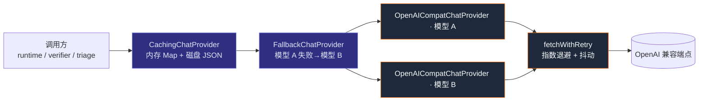

# 第 3 章 · 配置系统与 Provider 抽象

> 本章拆解两块地基：`config.ts`（把环境变量与仓库配置融合成一个类型化 `Config`）和 `src/providers/`（OpenAI 兼容的对话/嵌入抽象，以及重试、fallback、缓存这三层「洋葱皮」）。涉及文件：`src/config.ts`、`src/providers/{types,http,chat,embeddings,cache,fallback}.ts`、`src/util/fs.ts`。

## 3.1 配置：安装根 `.env` + 仓库级 `.reviewforge.json`

ReviewForge 既要能**全局安装**（`npm link` 后到处 `rf review`），又要支持**每个被审仓库有自己的偏好**。`config.ts` 用两套来源解决这对张力。

### 3.1.1 `.env` 跟着「安装根」走，而不是 `cwd`

一个容易踩的坑：如果 `.env` 从当前工作目录加载，那么 `cd` 到任意被审仓库执行 `rf review` 时就读不到你的 key。`config.ts` 的做法是从 `import.meta.url` 向上回溯，找到含 `package.json` 的**安装根目录**，再从那里加载 `.env`：

```ts
// src/config.ts · 从安装根（而非 cwd）加载 .env
//   → LLM_* / EMBED_* 等密钥跟着工具走，可在任意被审仓库目录里用
```

也就是说：**密钥配置一次，处处可用**，且不会泄漏进被审仓库。

### 3.1.2 三级优先级

`loadConfig` 把三个来源按优先级合并：

```
环境变量  >  仓库根 .reviewforge.json  >  zod 默认值
```

`RawConfig` 是一个 `zod` schema，给出了所有字段的默认值与类型强制（`z.coerce.number()` 等）。例如：

```ts
const RawConfig = z.object({
  llmBaseUrl: z.string().default("https://api.openai.com/v1"),
  llmApiKey: z.string().default(""),
  llmModel: z.string().default("gpt-4o-mini"),
  llmTemperature: z.coerce.number().default(0.1),
  llmMaxTokens: z.coerce.number().default(8192),
  cacheEnabled: z.string().default("1")
    .transform((v) => v !== "0" && v.toLowerCase() !== "false"),
  // ...embedModel / embedDim / structuredOutput / dataDir ...
});
```

最终 `Config = z.infer<typeof RawConfig> & { repoRoot, dataDirAbs }`——前者来自合并，后者是派生的绝对路径（`repoRoot` 默认 `cwd`，`dataDirAbs` 默认 `<repo>/.reviewforge`）。

### 3.1.3 占位符检测与「已配置」判断

`.env.example` 里塞的是占位符。`isPlaceholder` 把空串、`placeholder`、`fill_me_in` 这类值识别为「未配置」，于是：

```ts
export function chatConfigured(cfg: Config): boolean   // llmApiKey/url/model 都非占位
export function embedConfigured(cfg: Config): boolean  // 嵌入侧同理
```

这两个判断被 `cmdReview` / `cmdIndex` / `cmdDoctor` 反复使用，是「降级还是阻塞」的开关：嵌入未配置 → 索引退化为符号图 + 关键词；对话未配置 → 审查报错并提示 `--dry-run`。

### 3.1.4 嵌入默认复用对话端点

一个体贴的默认：`embedBaseUrl` / `embedApiKey` 在未单独设置时**回落到 LLM 的值**。很多内网网关对话与嵌入同源，这样只需配一套。

## 3.2 Provider 抽象：两个接口

`providers/types.ts` 定义了全部契约，核心是两个接口：

```ts
export interface ChatProvider {
  readonly model: string;
  chat(req: ChatRequest): Promise<ChatResponse>;
}
export interface EmbeddingProvider {
  readonly model: string;
  readonly dim: number;
  embed(texts: string[]): Promise<number[][]>;
}
```

`ChatRequest` 里有一个值得记住的**输出模式优先级**（在 `chat.ts` 里被严格执行）：

```
tools （function calling）
  > responseSchema （严格 json_schema，strict: true）
    > responseFormatJson （json_object）
```

也就是说：**要工具就别要 schema，要 schema 就走严格 JSON**。这条优先级是理解[第 7–8 章](./07-orchestrator-subagents)里「维度子 Agent 用工具、验证者/分诊用结构化 JSON」分工的关键。

## 3.3 三层「洋葱皮」：重试 → fallback → 缓存

回忆[第 2 章](./02-cli)的 `buildChatProvider`，一个对话 provider 实际上是层层包裹的：



从内到外逐层看。

### 3.3.1 最内层：`http.ts` 的退避重试

`fetchWithRetry` 是所有出网请求的统一传输层。它的策略：

- **可重试状态码**：`429` 与 `5xx`；
- **可重试错误**：网络错误、`AbortError`（超时通过 `AbortSignal.timeout` 触发）；
- **退避**：`min(1000 * 2^attempt, 16000)` 毫秒，外加最多 30% 抖动，避免「重试风暴」同步打到上游；
- **默认值**：4 次重试、120s 超时（各调用方会覆盖：对话 300s/3 次，嵌入 60s/4 次）。

```ts
// src/providers/http.ts · 退避
const delay = Math.min(1000 * 2 ** attempt, 16_000) + jitter;
```

非可重试的响应原样返回，交给上层处理——传输层只管「值不值得再试一次」。

### 3.3.2 `chat.ts`：把内部请求映射成 OpenAI 形状

`OpenAICompatChatProvider.chat` 做三件事：消息映射、请求体分支、响应解析。最值得看的是**请求体分支**，它正是 §3.2 那条优先级的落地：

```ts
// src/providers/chat.ts
if (req.tools?.length) {
  body.tools = req.tools.map(/* function 形状 */);
  body.tool_choice = "auto";
} else if (req.responseSchema) {
  body.response_format = { type: "json_schema",
    json_schema: { name, schema, strict: true } };
} else if (req.responseFormatJson) {
  body.response_format = { type: "json_object" };
}
```

> 注意：`json_schema` 被某些端点拒绝时的**回退**逻辑不在这里，而在 `agent/structured.ts` 的 `chatJson`（[第 8 章](./08-tools-verifier-aggregator)）。`chat.ts` 只负责忠实地把请求翻译成 API 形状；出错时抛出带状态码与响应体前 500 字的异常。

### 3.3.3 `embeddings.ts`：一个真实世界的小坑

`OpenAICompatEmbeddingProvider.embed` 里藏着一个非常「实战」的细节——**空字符串保护**：

```ts
// 空白/纯空串替换为 "(empty)"，避免某些网关（bge-m3）对全零向量做 L2 归一化时出 NaN
const safe = texts.map((t) => (t.trim() ? t : "(empty)"));
```

返回前还会按 `index` 排序，确保嵌入顺序与输入一致。配套的 `cosineSimilarity` 在任一向量范数为 0 时返回 `0`（而非 NaN）——这同样是给「降级零向量」兜底。这些向量后续被符号图检索（[第 4 章](./04-index-pipeline)）与记忆 recall（[第 9 章](./09-memory)）复用。

### 3.3.4 `fallback.ts`：顺序尝试多个模型

`FallbackChatProvider` 接收一个 provider 数组，依次尝试，任一抛错就切下一个，全失败则抛最后一个错：

```ts
// src/providers/fallback.ts
for (let i = 0; i < this.providers.length; i++) {
  try { return await this.providers[i].chat(req); }
  catch (err) { lastErr = err; /* 记日志，切下一个 */ }
}
throw lastErr;
```

它由 `LLM_FALLBACK_MODELS` 环境变量驱动（逗号分隔）。注意它的 `model` 属性只反映**第一个** provider——这在缓存键里有微妙影响（见下）。它本身**不重试**，重试交给更内层的 `http.ts`，职责分明。

### 3.3.5 `cache.ts`：内存 + 磁盘两级缓存

`CachingChatProvider` 是最外层装饰器，用请求指纹做键，命中则直接返回，省去真实 API 调用——这对**评测复跑**（同一 diff 反复跑消融）意义重大。

```ts
// src/providers/cache.ts · 三级查找
async chat(req) {
  if (!this.enabled) return this.inner.chat(req);
  const k = this.key(req);
  if (this.mem.has(k)) return this.mem.get(k)!;        // ① 内存
  try { return JSON.parse(await fs.readFile(file)); }  // ② 磁盘
  catch { /* miss */ }
  const res = await this.inner.chat(req);              // ③ 真实调用
  this.mem.set(k, res);
  await writeFileAtomic(file, JSON.stringify(res));    // 落盘（best-effort）
  return res;
}
```

缓存键是 `{ model, messages, tools, temperature, responseFormatJson }` 的 SHA-256（截断 32 hex）。

> **一个值得记住的 caveat**：键里**不含 `responseSchema`**。也就是说，消息完全相同但 schema 不同的两个请求会**撞缓存**。在 ReviewForge 的实际用法里这不构成问题（schema 与消息内容强相关），但若你要复用这套缓存，需留意这个边界。

缓存可由 `RF_CACHE=0` 关闭——评测里测「真实方差」时正是这么做的（[第 11 章](./11-eval)）。

### 3.3.6 `util/fs.ts`：原子写

缓存落盘与长期记忆保存都走 `writeFileAtomic`：先写同目录下的唯一临时文件，再 `rename` 覆盖目标。这样并发的 `rf review` 与 `rf feedback` 不会读到「写了一半」的文件：

```ts
// src/util/fs.ts
const tmp = path.join(dir, `.${base}.${pid}.${rand}.tmp`);
await fs.writeFile(tmp, data);
await fs.rename(tmp, file);  // 失败则清理 tmp 并抛出
```

`rename` 在同一文件系统上是原子的（Windows 上对应 `MOVEFILE_REPLACE_EXISTING` 语义）。

## 3.4 关键环境变量速查

| 变量 | 作用 |
|---|---|
| `LLM_BASE_URL` / `LLM_API_KEY` / `LLM_MODEL` | 对话 provider（OpenAI 兼容） |
| `LLM_FALLBACK_MODELS` | 逗号分隔的兜底模型，启用 `FallbackChatProvider` |
| `EMBED_BASE_URL` / `EMBED_API_KEY` / `EMBED_MODEL` / `EMBED_DIM` | 嵌入 provider（配置后启用 `semantic_search`） |
| `RF_CACHE` | 响应缓存开关（`0` 关闭） |
| `RF_STRUCTURED_OUTPUT` | 是否启用 `json_schema` 严格输出（探测失败自动回落） |
| `RF_DATA_DIR` | 索引 / 记忆 / trace 的根目录（默认 `./.reviewforge`） |
| `RF_TRACE_ENDPOINT` / `RF_TRACE_TOKEN` | 托管式 trace 上报 |

## 3.5 小结

- 配置层用「**安装根 `.env` + 仓库级 JSON + zod 默认值**」三级合并，既能全局安装又能仓库定制；`chatConfigured` / `embedConfigured` 是「降级 or 阻塞」的总开关。
- Provider 层是一组**可组合的装饰器**：`fetchWithRetry`（退避重试）→ `OpenAICompatChatProvider`（协议映射）→ `FallbackChatProvider`（多模型兜底）→ `CachingChatProvider`（两级缓存）。每层职责单一、互不越界。
- 一系列实战细节——空字符串保护、零向量兜底、原子写、缓存键的 schema caveat——再次印证了贯穿全书的「防御式工程」。

有了配置与 provider 这两块地基，下一章我们进入**离线索引管道**，看 ReviewForge 如何把一个仓库变成可检索的符号图与向量库。
