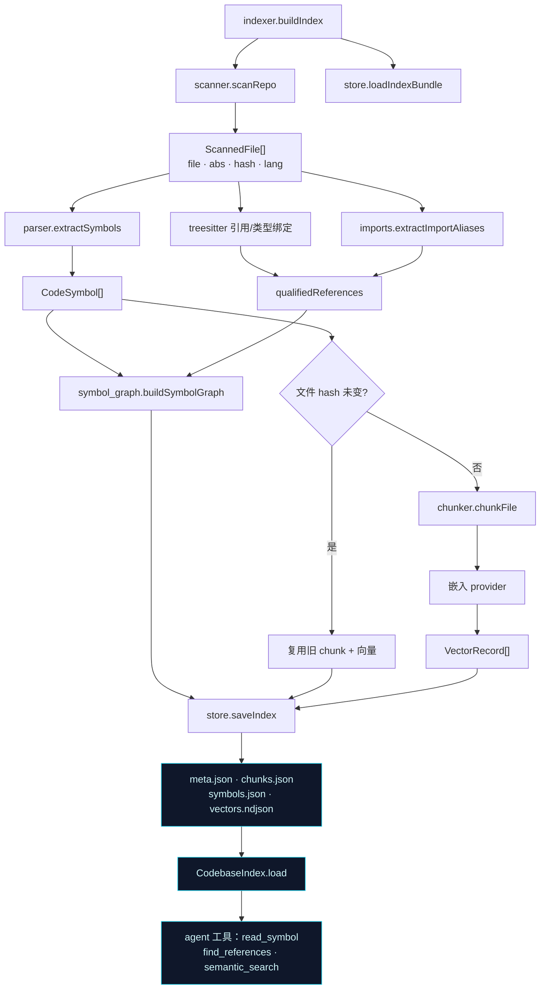

# 第 4 章 · 索引管道：从源码到符号图与向量

> 本章拆解 `src/index/` 的九个模块。它们合力实现一个**构建时代码库索引**：发现源文件、抽取符号与调用图、按符号分块、可选嵌入、持久化到磁盘，并暴露给审查 Agent 查询的 API。这是 `rf index` 与 `--reindex` 背后的全部机器。涉及文件：`src/index/{types,scanner,parser,treesitter,chunker,symbol_graph,imports,indexer,store}.ts`。

## 4.1 端到端数据流

九个模块的协作关系如下，`indexer.ts` 是总指挥：



磁盘产物落在 `<dataDir>/index/`：

| 文件 | 内容 |
|---|---|
| `meta.json` | `IndexMeta`——嵌入模型/维度、git commit、时间戳、**每文件 SHA1** |
| `chunks.json` | `CodeChunk[]` |
| `symbols.json` | `SymbolGraphData`（定义 + 引用） |
| `vectors.ndjson` | 每行一个 `VectorRecord`（流式友好） |

## 4.2 `types.ts`：贯穿全程的数据模型

纯 schema、无逻辑。几个关键约定：

- **行号一律 1-based、闭区间**（`startLine`/`endLine`），从 parser 到 chunker 到工具到 Gerrit 引用全程一致；
- **chunk 身份**：`CodeChunk.id` 由 `file:startLine:endLine` 的 SHA1 派生（在 `chunker.ts`），向量只靠 `id` 关联 chunk；
- **新鲜度**：`IndexMeta.fileHashes` 是「仓库相对路径 → SHA1」的映射，增量重建的依据；
- **`hasVectors`** 布尔位：调用方无需探测 `vectors.ndjson` 即可知道语义检索是否可用。

```ts
export interface CodeSymbol {
  name: string;
  kind: SymbolKind;          // function|method|class|struct|namespace|enum|other
  file: string;
  startLine: number;         // 1-based, inclusive
  endLine: number;
}
```

## 4.3 `scanner.ts`：发现文件、计算哈希、判定语言

入口模块。它枚举**被 git 跟踪的源文件**，计算内容哈希并按扩展名判定语言。

- **文件清单**优先用 `git ls-files --cached --others --exclude-standard`，从而**尊重 `.gitignore`**；非 git 仓库则回退到递归 `walkDir`（跳过 `node_modules`、`.git` 及以 `.` 开头的目录）；
- **哈希**：逐文件读字节、SHA1 hex；读不了的文件**静默跳过**（不崩）。

```ts
// src/index/scanner.ts · 核心循环
const hash = crypto.createHash("sha1").update(content).digest("hex");
result.push({ file, abs, hash, lang: LANG_BY_EXT[ext] ?? "text" });
```

`LANG_BY_EXT` 这张「扩展名 → 语言」表会被审查侧的 `diff.ts`、`tools.ts` 在查询时复用。

## 4.4 `parser.ts` + `treesitter.ts`：符号抽取的「主 + 备」

符号抽取是双路设计：**主路径用 tree-sitter，备路径用启发式正则（仅 C/C++）**。

```ts
// src/index/parser.ts · 分派
if (treeSitterSupports(lang)) {
  const ts = await extractSymbolsTreeSitter(file, text, lang);
  if (ts !== null) return ts;          // tree-sitter 成功则用它
}
if (C_FAMILY.has(lang)) return extractSymbolsHeuristic(file, text); // 兜底
return [];
```

### 4.4.1 tree-sitter 引擎

`treesitter.ts` 用 `web-tree-sitter`（WASM）加载 `tree-sitter-wasms` 里的各语言 grammar，支持 9 种语言 id（c/cpp/python/go/rust/java/javascript/typescript/tsx）。它做了大量工程化处理：

- **懒初始化**：`Parser.init()` 只跑一次；grammar、定义查询、引用查询、类型绑定查询各有缓存；
- **任何加载/解析/查询错误都返回 `null`**——交给调用方降级或跳过，绝不崩溃；
- 三类查询：
  - **定义查询**（`@def` + `@name`）→ 符号；
  - **引用查询**（`@callee` + 可选 `@receiver`）→ 调用点，支撑 `Type.method` 这种限定键；
  - **类型绑定查询**（保守的同文件 `变量 → 类型`）→ 为限定引用提供类型推断。

```ts
// src/index/treesitter.ts · 符号抽取循环（去重 + 排序）
const startLine = defCap.node.startPosition.row + 1;
const endLine = defCap.node.endPosition.row + 1;
const key = `${name}:${startLine}:${endLine}`;
if (seen.has(key)) continue;
symbols.push({ name, kind: kindForNode(defCap.node.type), file, startLine, endLine });
```

> **为什么锁定 `web-tree-sitter` 0.22.6？** 这是 grammar wasm 的 ABI 兼容性问题——0.26 在该环境下 dylink 失败。代价是 API 较旧，但换来了跨平台、免编译的可移植性（呼应[第 1 章](./01-overview)的设计抉择）。

### 4.4.2 启发式兜底（C/C++）

当 tree-sitter 不可用时，C/C++ 走一套巧妙的正则方案。它的精髓在 `maskNonCode`——**单遍扫描，把注释和字符串/字符字面量「抹白」（保留换行与位置）**，这样后续正则匹配不会被字符串里的 `{}` 或关键字误导：

```ts
// 第一步：maskNonCode 把 // /* */ 与 "..." '...' 内容置空但保留位置
// 第二步：lineStarts + 二分把字节偏移映射成行号
// 第三步：matchBrace 从 { 向前数深度找到配对 }
// 第四步：两遍正则——先抓 namespace/class/struct/enum，再抓函数/方法
```

这套「先掩码再匹配」的技巧，是在不引入完整解析器的前提下，尽量逼近 AST 准确度的务实选择。

## 4.5 `chunker.ts`：按符号对齐的分块

`chunkFile` 把「文件文本 + 符号」变成适合嵌入/检索的 `CodeChunk[]`：

- **有符号**：一符号一 chunk，正文取 `[startLine..endLine]`，空体跳过；
- **无符号**（解析失败或非支持语言）：回退到 **200 行窗口**整文件切块；
- 单 chunk 文本上限 `MAX_CHUNK_CHARS = 4000`，超出截断；
- `id = SHA1("file:start:end")[:16]`——稳定，增量重建时可比对。

```ts
// src/index/chunker.ts
for (const sym of symbols) {
  const body = sliceLines(lines, sym.startLine, sym.endLine).slice(0, MAX_CHUNK_CHARS);
  if (!body.trim()) continue;
  chunks.push({ id: chunkId(file, sym.startLine, sym.endLine), file,
    symbol: sym.name, kind: sym.kind, startLine: sym.startLine, endLine: sym.endLine, text: body, lang });
}
```

「按符号对齐」意味着语义检索返回的是**一个完整函数/类**，而非随意切断的文本窗口——这对审查时「把整个被调函数喂给模型」很重要。

## 4.6 `symbol_graph.ts`：定义与引用图

`buildSymbolGraph` 把所有符号定义和调用点聚合成可查询的图。`SymbolGraph` 类是查询 API，被 `read_symbol`、`find_definition`、`find_references` 三个工具直接使用（[第 8 章](./08-tools-verifier-aggregator)）。

```ts
export interface SymbolGraphData {
  definitions: Record<string, CodeSymbol[]>;         // 名字 → 定义点（可多个：重载/头实现）
  references?: Record<string, ReferenceSite[]>;       // callee 名 → 调用点
  qualifiedReferences?: Record<string, ReferenceSite[]>; // Type.method → 调用点（消歧）
}
```

### 4.6.1 防原型污染

这是一个容易被忽视但很关键的细节：真实代码里会有名为 `toString`、`constructor`、`hasOwnProperty` 的符号。如果用普通对象做映射，这些名字会撞上原型链。`symbol_graph.ts` 全程用 `Object.create(null)` 建表、用 `hasOwnProperty` 取值，杜绝这类污染。

### 4.6.2 限定方法消歧（R3）

C++/OOP 里 `foo.method()` 和 `bar.method()` 是不同目标，但裸名 `method` 无法区分。`resolveQualifiedDefinition(qualifier, name)` 用一套**逐级回退**的启发式定位真正的定义：

1. 只有 ≤1 个方法定义 → 直接返回；
2. 找 `qualifier` 类型的定义；
3. 优先**文本上嵌套在类型行范围内**的方法（类内定义）；
4. 否则优先**与类型同文件**的方法（应对 C++ 头/源分离、`.cpp` 里的类外定义）；
5. 都不行 → 返回全部候选。

`findReferences(name, qualifier?)` 同理：给了 `qualifier` 就优先查 `qualifiedReferences["qualifier.name"]`，引用数上限 `MAX_REFS = 50`。

## 4.7 `imports.ts`：跨文件别名归一

限定引用要跨文件可比，就得把 `import { Foo as Bar }` 里的 `Bar` 归一回 `Foo`。`imports.ts` 故意用**正则**（便宜、无 AST 依赖）解析三类语言的 `as` 别名：

- TS/JS：`import { Foo as Bar } from "..."`（含 `type` 导入）；
- Python：`from pkg import Foo as F`、`import pkg.mod as m`；
- Go：`alias "path/pkg"`。

```ts
export function canonicalize(name: string, aliases: ImportAliasMap): string {
  return aliases[name] ?? name;  // 别名 → 原名
}
```

它**只处理会破坏名字匹配的 `as` 别名**，刻意跳过 `import * as NS` 与默认导入。

## 4.8 `indexer.ts`：把一切串起来的总指挥

`buildIndex` 是分阶段的流水线。最值得讲的两点是**增量复用**与**调用图构建**。

### 4.8.1 增量：贵的复用，便宜的重算

核心权衡是：**解析便宜、嵌入贵**。所以：

- **符号与引用始终重建**（解析成本低）；
- **chunk 与向量在「文件 SHA1 未变且嵌入模型/维度未变」时复用**（省下昂贵的嵌入调用）。

这正是 `rf review --reindex` 能快速刷新上下文的原因。

### 4.8.2 `addRefs`：调用图的心脏

这个闭包把引用、类型绑定、别名归一三者合成 `qualifiedReferences`：

```ts
// src/index/indexer.ts · addRefs
const sites = await extractReferencesTreeSitter(text, lang);
const aliases = extractImportAliases(text, lang);
const bindings = await extractTypeBindingsTreeSitter(text, lang);
const varType = new Map<string, string>();
if (bindings) for (const b of bindings) varType.set(b.variable, canonicalize(b.type, aliases));

for (const s of sites) {
  (references[s.callee] ??= []).push({ file, line: s.line });
  if (s.receiver) {
    const qualifier = varType.get(s.receiver) ?? canonicalize(s.receiver, aliases);
    (qualifiedReferences[`${qualifier}.${s.callee}`] ??= []).push({ file, line: s.line });
  }
}
```

引用映射同样用 `Object.create(null)`，每名上限 50。

### 4.8.3 弹性嵌入：二分降级

嵌入阶段用 `EMBED_BATCH = 64` 批量调用。但批量里一个坏 chunk 不该毁掉整个索引——`embedResilient` 在批失败时**递归二分**，最终单 chunk 仍失败就给它一个**零向量**（余弦视为不匹配）。于是「一个文件嵌不出来」最多让那个 chunk 检索不到，而不会让 `rf index` 整体失败。又一次「失败即降级」。

### 4.8.4 `assessIndexFreshness`：廉价陈旧检查

审查时不会重哈希整库，而是**只重哈希改动文件**并比对 `meta.fileHashes`，再加一个 `git rev-parse HEAD` 与 `meta.commit` 的比较。任一不符即 `stale`，触发[第 2 章](./02-cli)里的告警。删除/读不到的文件不算陈旧。

## 4.9 `store.ts`：持久化与查询 API

- **写**：`saveIndex` 全程用 `writeFileAtomic`（[第 3 章](./03-config-providers)）保证崩溃安全；`vectors.ndjson` 用换行分隔，流式友好；
- **读**：`loadIndexBundle` 任一文件缺失/损坏即返回 `null`，向量文件可选；
- **查**：`CodebaseIndex` 构造时建 `byId: Map`，`search(queryVector, k)` 是**暴力线性扫描 + 余弦相似度 + 取 top-k**。

```ts
// src/index/store.ts · 暴力向量检索
for (const rec of this.vectors) {
  const chunk = this.byId.get(rec.id);
  if (!chunk) continue;
  scored.push({ chunk, score: cosineSimilarity(queryVector, rec.vector) });
}
scored.sort((a, b) => b.score - a.score);
return scored.slice(0, k);
```

> **为什么是暴力检索？** 对中小仓库的 chunk 量级，内存余弦的延迟可忽略（<10ms 级），且**零额外依赖**。这是有意识的 MVP 取舍——超大仓库再切 `sqlite-vec` / `hnswlib-node`。

## 4.10 贯穿主题

1. **增量 vs 全量**：符号/引用必重建，chunk/向量按 hash 复用——这是审查刷新的主要提速点。
2. **R3 限定方法消歧**：tree-sitter 的 `@receiver` 捕获 + 同文件类型绑定 + `canonicalize` + `resolveQualifiedDefinition` 四件套协作。
3. **处处防御**：`Object.create(null)` 防原型污染、嵌入二分降级、解析器三级回退（tree-sitter → 启发式 → 空）、`maskNonCode` 防误匹配。
4. **明确的非目标**：无 LSP/clangd、无完整跨文件 import 图（只做别名归一）、无 ANN 索引、启发式解析仅 C/C++。

下一章进入**在线审查的第一步**：把一个 git diff 变成「带改动符号、静态分析信号、规范与历史范例」的审查上下文包。
