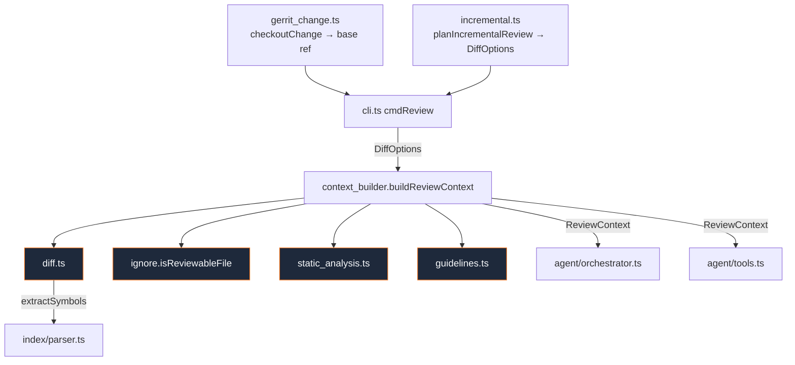
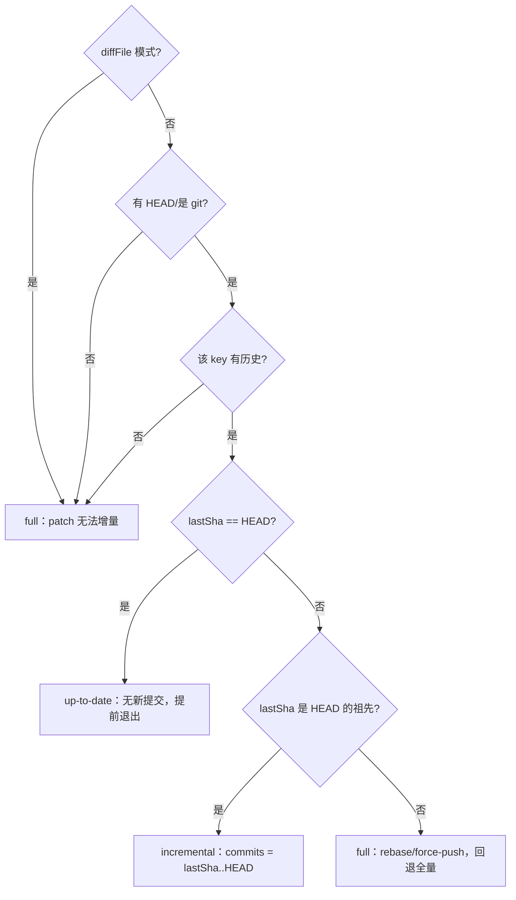

# 第 5 章 · Diff 摄取与上下文构建

> 本章拆解 `src/review/` 的七个模块。它们把一个 git diff（或 patch 文件）变成一个 **`ReviewContext`** 包——后续被状态图、工具层与评测 runner 共享。我们会沿着「拉什么 → 审哪些文件/行 → 怎么富化 → 怎么组装」的顺序展开。涉及文件：`src/review/{diff,context_builder,static_analysis,guidelines,ignore,incremental,gerrit_change}.ts`。

## 5.1 七模块的协作



职责分工很清晰：

- `gerrit_change` 与 `incremental` 决定**拉取/比对什么**；
- `diff` 与 `ignore` 决定**审哪些文件/行**；
- `static_analysis` 与 `guidelines` 负责**富化**；
- `context_builder` 负责**组装**。

## 5.2 `diff.ts`：解析 diff、映射改动符号

这是审查侧的地基：取得统一 diff 文本 → 解析成 per-file hunk → 把改动行映射到工作区里的 `CodeSymbol`。

### 5.2.1 三种输入模式

`getDiffText` 支持 patch 文件、提交范围、分支三种来源：

```ts
// src/review/diff.ts
// diffFile  → 直接读 patch
// commits   → git diff --no-color --unified=3 <commits>
// base      → git diff ... ${base}...HEAD   （三点 merge-base 范围）
// 默认       → git diff HEAD                  （工作区相对 HEAD）
```

### 5.2.2 `parseDiff`：一台逐行状态机

`parseDiff` 用正则锚定 `diff --git` 文件头与 `@@` hunk 头，并维护新侧行号计数器。**它取 b-side 路径作为 `file`**，并据 git 元数据判定 `added/deleted/renamed/modified`。最微妙的是行号计数：

```ts
// src/review/diff.ts · 新侧行号会计
if (line.startsWith("+") && !line.startsWith("+++")) {
  hunk.changedLines.push(newLineNo); newLineNo++;        // 新增行：记录并前进
} else if (line.startsWith("-") && !line.startsWith("---")) {
  // 删除行：不前进新侧计数
} else if (!line.startsWith("\\")) {
  newLineNo++;                                            // 上下文行：仅前进
}
```

### 5.2.3 删除感知：`effectiveChangedLines`

一个很容易漏掉的场景：**纯删除**（移除了一个安全检查却没加任何 `+` 行）。如果只看 `+` 行，这种改动会「没有改动行」，从而映射不到任何符号、审不出来。`effectiveChangedLines` 专门处理：

```ts
// src/review/diff.ts
if (h.changedLines.length > 0) out.push(...h.changedLines);     // 有新增行
else if (h.newLines > 0) for (...) out.push(h.newStart + i);    // 纯删除：用新侧窗口
else out.push(h.newStart);                                       // 兜底
```

`buildChangedRegions` 随后对每个文件读工作区内容、`extractSymbols`（复用[第 4 章](./04-index-pipeline)的 parser）、用行重叠判断把改动行落到具体符号上。删除的文件没有可解析正文，符号为空。

## 5.3 `context_builder.ts`：组装 `ReviewContext`

`buildReviewContext` 是唯一入口，产出贯穿整个 Agent 栈的对象：

```ts
interface ReviewContext {
  diffText: string;
  regions: ChangedRegion[];      // 改动文件 + 改动符号 + 改动行 + hunks
  staticFindings: StaticFinding[];
  guidelines: Guidelines;
  changedFiles: string[];
}
```

它按序做七步：取 diff → `parseDiff` → 用 `isReviewableFile` 过滤 → 计算 `changedFiles` → `buildChangedRegions` → （非 `skipStatic` 时）跑静态分析并**按改动行 ±3 过滤** → 加载规范 → 组装返回。

```ts
// src/review/context_builder.ts · 主干
const diffText = await getDiffText(cfg.repoRoot, opts);
const fileDiffs = parseDiff(diffText).filter((f) => isReviewableFile(f.file));
// ...buildChangedRegions / runStaticAnalysis+filterToChangedLines / loadGuidelines...
return { diffText, regions, staticFindings, guidelines, changedFiles };
```

其中 `skipStatic` 选项给评测的消融用（[第 11 章](./11-eval)）。

## 5.4 `static_analysis.ts`：多语言、尽力而为的事实信号

这是「双脑融合」里**确定性的那一半**。它对改动文件按语言跑外部分析器，归一成 `StaticFinding`，再过滤到 diff 附近的行。

### 5.4.1 分析器注册表

注册顺序为 **clang-tidy → ruff → go vet → eslint**。每个分析器实现统一的 `Analyzer` 接口（`available()` + `run()`）。`runStaticAnalysis` 按语言分组文件、跳过不可用的分析器、汇总命中：

```ts
// src/review/static_analysis.ts · 分派
for (const analyzer of ANALYZERS) {
  const targets = analyzer.languages.flatMap((l) => byLang.get(l) ?? []);
  if (targets.length === 0) continue;
  if (!(await analyzer.available(cfg))) continue;   // 不可用 → 静默跳过
  all.push(...await analyzer.run(cfg, [...new Set(targets)]));
}
```

「不可用即跳过」正是[第 1 章](./01-overview)所说的优雅降级——没装 clang-tidy，审查照常进行。

### 5.4.2 clang-tidy 的工程细节

最深入的是 clang-tidy 适配：

- 用正则解析 `file:line:col: severity: message [rule]`，跳过 `note` 级；
- 自动在仓库根、`build/`、`out/`、`cmake-build-debug/` 找 `compile_commands.json`；
- **若仓库存在 `.clang-tidy`，则尊重项目配置、不再注入默认 check 集**；否则用一套默认 bundle（`clang-analyzer-*,bugprone-*,cppcoreguidelines-*` 等）；
- 每文件 180s 超时，`reject: false`（即便非零退出也解析其输出）。

ruff（`--output-format=json`）、go vet（对整个 module 跑 `./...`）、eslint（`npx eslint -f json`）各有类似的尽力而为处理。

### 5.4.3 噪声治理：两道过滤

静态分析最大的问题是噪声。ReviewForge 用两层削减：

1. **文件级**：`isReviewableFile`（见下）；
2. **finding 级**：`filterToChangedLines`——只保留「与某条改动行相距 ≤ window（默认 3）」的命中。

这保证注入模型的静态信号都**和本次改动相关**，而非整文件的历史告警。

## 5.5 `guidelines.ts`：项目规范发现

`loadGuidelines` 按固定顺序找 `CONTRIBUTING(.md)`、`AGENTS.md`、`CODING_GUIDELINES.md`、`STYLE.md`、`.clang-tidy`，拼接成一段带 `# 文件名` 前缀的文本，上限 `MAX_GUIDELINE_CHARS = 8000`（超出截断）。无语义解析，原样透传——交给 `read_guidelines` 工具和 user prompt 使用。

## 5.6 `ignore.ts`：两套独立的「忽略」

容易混淆的一点：这里有**两个职责完全不同**的忽略机制。

| 函数 | 时机 | 作用 |
|---|---|---|
| `isReviewableFile` | 预处理（进 `ReviewContext` 前） | 硬编码规则：跳过锁文件、压缩产物、二进制、`dist/`/`node_modules/` 等，且扩展名须在可审名单内 |
| `loadIgnoreGlobs` | 审查后（聚合阶段） | 读仓库根 `.rfignore`，用户自定义 glob，传给聚合器抑制 finding（[第 8 章](./08-tools-verifier-aggregator)） |

```ts
// src/review/ignore.ts
export function isReviewableFile(file: string): boolean {
  if (SKIP_PATTERNS.some((re) => re.test(file))) return false;
  return REVIEWABLE_EXT.has(path.extname(file).toLowerCase());
}
```

前者是「**机器不该读的文件**」（纯路径/扩展名判断、无内容检查），后者是「**人不想被打扰的范围**」。

## 5.7 `incremental.ts`：PR-update 增量审查（R4a）

它在 `<dataDir>/review-state.json` 里记录每个审查目标「上次审到的 HEAD」，下次只 diff `lastSha..HEAD`。

### 5.7.1 审查目标的键

`reviewKey` 按优先级 `pr: > gerrit: > base: > branch: > "default"` 生成键——同一个 PR/change 的多次推送共享一条记录。

### 5.7.2 决策树

`planIncrementalReview` 的核心是一棵安全的决策树：



判断「是否祖先」用 `git merge-base --is-ancestor`，因此遇到 rebase / force-push 会**安全回退到全量审查**，而不是错误地只审一部分。审查成功后 `recordReviewed` 更新标记（无可审改动时记 `"skipped"`，避免每次推送都重扫非源码 delta）。

## 5.8 `gerrit_change.ts`：把一个 change 号变成可审代码

这是 `rf review-change`（[第 2 章](./02-cli)）的预处理：用 Gerrit REST API 解析 change 元数据 → fetch patchset ref 与目标分支 → 本地 checkout → 返回 diff base 给标准审查管线。

- `gerritConnFromEnv` 读 `GERRIT_URL/USER/HTTP_PASSWORD`，缺一即 `null`；
- `gerritGet` 用 HTTP Basic 认证、剥离 Gerrit 的 XSSI 前缀 `)]}'`、走 `fetchWithRetry`；
- `fetchChangeInfo` 拿到形如 `refs/changes/56/10132156/3` 的 ref。

### 5.8.1 一个真实的 `FETCH_HEAD` 陷阱

`checkoutChange` 里有一段注释道破了一个隐蔽 bug：先 fetch 了 patchset（`FETCH_HEAD` = patchset），又 fetch 了目标分支用于求 merge base——**第二次 fetch 会覆盖 `FETCH_HEAD`**。所以必须先把 patchset 的 sha 捕获下来，checkout 时用捕获的 sha，而不是此刻的 `FETCH_HEAD`：

```ts
// src/review/gerrit_change.ts
// Check out the captured patchset sha, NOT FETCH_HEAD: the target-branch
// fetch above overwrites FETCH_HEAD with the branch tip, so using it here
// would silently check out the branch instead of the change (empty diff).
await git(repoRoot, ["checkout", "-B", localBranch, headSha]);
```

否则会「静默地 checkout 成目标分支 → diff 为空」。这种 bug 不会报错，只会让审查结果莫名其妙为空——值得作为「读源码涨经验」的典型案例。

base ref 优先取 `origin/<branch>`，求不到则回退 `headSha~1`。

## 5.9 小结

- `ReviewContext` 是审查侧的「中心数据结构」，由 `buildReviewContext` 一站式组装；
- **删除感知的符号映射**、**静态信号的两道过滤**、**两套语义不同的忽略机制**，都是为「精准且低噪」服务的工程细节；
- `incremental` 与 `gerrit_change` 把工具接入真实的 PR/Gerrit 工作流，且都做了安全回退（增量遇 rebase 回退全量、Gerrit 处理 `FETCH_HEAD` 陷阱）。

上下文备好了，下一章进入**全书核心**：那张约 70 行就跑起来的手写状态图。
