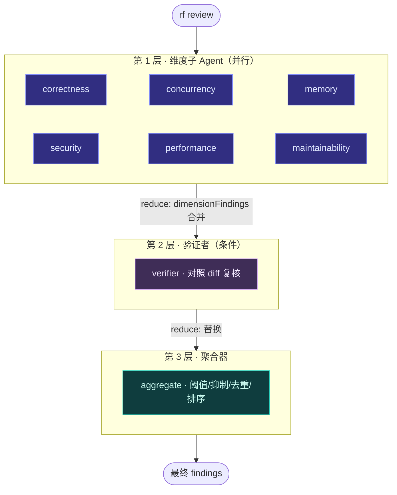

# 第 6 章 · 手写状态图运行时与共享状态

> 本章是全书核心。ReviewForge **不依赖 LangChain/LangGraph**，而是用约 70 行自己实现了「agent = 有状态图」范式。我们逐行拆解 `graph.ts`（运行时）与 `state.ts`（类型化状态 + reducer），并解释「为什么手写、手写得到了什么」。涉及文件：`src/agent/graph.ts`、`src/agent/state.ts`。

## 6.1 为什么手写状态图

审查任务天然是一种 **map-reduce**：一份 diff → 多个维度并行深挖 → 汇总成一份报告。这恰好契合「有状态图」范式。ReviewForge 的决策是：

> 不引入框架，但**显式实现**框架形式化的那套范式——节点、类型化共享状态、reducer、条件路由、并行扇入扇出、checkpoint、节点级错误隔离。

收益是**控制力、透明度、最轻依赖**，以及——对读这本书的人而言——**把范式本身讲清楚**。代价是部分管线要自己写，但量小得惊人：运行时仅约 70 行。

下表是「图概念 → ReviewForge 落地」的对照，本章与[第 7–8 章](./07-orchestrator-subagents)会逐一兑现：

| 图概念 | 落地 | 代码位置 |
|---|---|---|
| 节点 Node | Orchestrator/Triage、6 维度子 Agent、Verifier、Aggregator | `orchestrator.ts` |
| 共享状态 State | `ReviewState`（类型化） | `state.ts` |
| Reducer | 各字段不同归并策略 | `state.ts:reduce` |
| 边 / 分层 | 用节点的 `layer` 序号表达依赖，而非显式 edge 列表 | `graph.ts` |
| 条件路由 | 节点的 `shouldRun(state)` | `graph.ts` / `orchestrator.ts` |
| 并行扇入扇出 | 同层并发 + reducer 扇入 | `graph.ts:mapWithConcurrency` |
| 环 Cycle | 子 Agent 内的 tool-calling 微循环 | `runtime.ts`（[第 7 章](./07-orchestrator-subagents)） |
| 错误隔离 | `try/catch` 兜成空 `Partial` | `graph.ts` |
| Checkpoint | 每层落盘快照 | `checkpoint.ts`（[第 9 章](./09-memory)） |

## 6.2 `graph.ts`：约 70 行的运行时

### 6.2.1 节点的定义

一个节点就是一个带 `layer` 的对象，核心是 `run(state) => Promise<Partial<state>>`：

```ts
// src/agent/graph.ts
export interface GraphNode<S> {
  name: string;
  layer: number;
  run(state: S): Promise<Partial<S>>;
  shouldRun?(state: S): boolean;
}
```

**关键设计**：节点之间**不直接互相调用**，只产出 `Partial<S>`，由 reducer 归并进共享状态。这让并行节点的结果可安全合并，也让中断续跑成为可能。

### 6.2.2 `runGraph`：分层调度器

整个运行时就是下面这段：

```ts
// src/agent/graph.ts
export async function runGraph<S>(opts: RunGraphOptions<S>): Promise<S> {
  let state = opts.initial;
  const layers = [...new Set(opts.nodes.map((n) => n.layer))].sort((a, b) => a - b);

  for (const layer of layers) {
    const active = opts.nodes.filter(
      (n) => n.layer === layer && (!n.shouldRun || n.shouldRun(state)),
    );
    if (active.length === 0) continue;

    const snapshot = state; // nodes in a layer see the same input state
    // Isolate failures: one node's error must not abort the whole layer.
    const partials = await mapWithConcurrency(active, opts.concurrency, async (node) => {
      try {
        return await node.run(snapshot);
      } catch (err) {
        process.stderr.write(`  [node ${node.name}] failed: ${(err as Error)?.message}\n`);
        return {} as Partial<S>;
      }
    });
    for (const p of partials) state = opts.reduce(state, p);
    await opts.onLayerComplete?.(layer, state);
  }
  return state;
}
```

短短二十几行，蕴含了四个关键语义，逐一展开。

### 6.2.3 语义一：层即依赖

`layers` 是节点 `layer` 字段**去重排序**的结果。图严格逐层执行，**层与层之间是天然 barrier**——下一层一定看到上一层归并后的完整状态。

> 这是手写实现里最优雅的简化：**增删一层只需改节点的 `layer` 字段，无需维护任何 edge 列表**。依赖关系被「层序」隐式表达了。

ReviewForge 用了三层：



（编排选维度的「第 0 层」在图外，由 `orchestrator.ts` 完成，见[第 7 章](./07-orchestrator-subagents)。）

### 6.2.4 语义二：同层共享同一份输入快照

```ts
const snapshot = state; // nodes in a layer see the same input state
```

同层所有节点拿到的是**层开始时的同一份 `snapshot`**，而非边跑边更新。对维度子 Agent 而言，这意味着它们在第 1 层**互相看不到彼此的 findings**——每个维度独立审查，避免相互污染。这是「并行」语义正确性的前提。

### 6.2.5 语义三：节点级错误隔离

```ts
try { return await node.run(snapshot); }
catch (err) { /* 记 stderr */ return {} as Partial<S>; }
```

单个节点抛错被兜成空 `Partial`，**不中断整层**。某个维度子 Agent 因为 LLM 超时挂了？其他五个维度照常产出，审查报告依然有内容。这是「生产级鲁棒性」最直接的体现。

### 6.2.6 语义四：条件节点

`shouldRun(state)` 在该层运行前对当前状态求值。验证者正是用它实现「**仅在存在候选 finding 时才跑**」——没有候选就整层跳过，直接进聚合器，省一次 LLM 调用。

### 6.2.7 并发池：`mapWithConcurrency`

并行不是无限的——它受 `RF_CONCURRENCY`（默认 3）约束，由一个自写的 worker-pool 实现：共享一个原子游标 `cursor`，`min(limit, items.length)` 个 worker 不断取活，结果按输入顺序回填 `results[idx]`：

```ts
// src/agent/graph.ts · 概念
const workers = Array.from({ length: Math.min(limit, items.length) }, async () => {
  while (true) {
    const idx = cursor++;
    if (idx >= items.length) break;
    results[idx] = await fn(items[idx]);
  }
});
await Promise.all(workers);
```

限制并发既是为了不打爆上游 API 速率，也是控制 token 消耗。

## 6.3 `state.ts`：类型化状态与 reducer

### 6.3.1 `ReviewState`

图的共享状态是一个类型化对象：

```ts
// src/agent/state.ts
export interface ReviewState {
  runId: string;
  context: ReviewContext;                       // 来自第 5 章
  dimensionFindings: Record<string, RawFinding[]>; // category → 该维度产出
  findings: Finding[];                           // 最终聚合结果
  usage: { promptTokens: number; completionTokens: number };
  trace: TraceEntry[];                           // 每节点观测
}
```

`TraceEntry` 记录每个节点的 `{ node, toolCalls, promptTokens, completionTokens, ms, findings, note? }`——这是可观测性的原始素材（[第 7 章](./07-orchestrator-subagents)）。

### 6.3.2 Reducer：不同字段，不同归并策略

reducer 是「并行结果可安全合并」的关键。不同字段的归并语义不同：

```ts
// src/agent/state.ts
export function reduce(state: ReviewState, partial: Partial<ReviewState>): ReviewState {
  const next = { ...state };
  if (partial.dimensionFindings) {
    next.dimensionFindings = { ...state.dimensionFindings, ...partial.dimensionFindings }; // 合并
  }
  if (partial.findings) {
    next.findings = partial.findings;                                                      // 替换
  }
  if (partial.usage) {
    next.usage = {                                                                         // 累加
      promptTokens: state.usage.promptTokens + partial.usage.promptTokens,
      completionTokens: state.usage.completionTokens + partial.usage.completionTokens,
    };
  }
  if (partial.trace) {
    next.trace = [...state.trace, ...partial.trace];                                       // 追加
  }
  return next;
}
```

| 字段 | 策略 | 谁写 | 为什么 |
|---|---|---|---|
| `dimensionFindings` | **合并**（按 category 键） | 维度节点 / 验证者 | 各维度键互不相干，并行写不冲突 |
| `findings` | **替换** | 仅聚合器 | 最终结果由唯一汇总节点产出 |
| `usage` | **累加** | 所有 LLM 节点 | 全局 token 预算 |
| `trace` | **追加** | 所有节点 | 完整保留每节点观测 |

`runId` 与 `context` 永不通过 partial 更新——它们在整张图里不可变。

> **一个值得注意的细节**：验证者会用**复核后的整套集合**一次性替换 `dimensionFindings`（通过对象 spread 覆盖所有 category 键），从而把被丢弃的 finding 真正移除。这点在[第 8 章](./08-tools-verifier-aggregator)展开。

### 6.3.3 为什么这套设计能「中断续跑」

因为节点只读 `snapshot`、只写 `Partial`，状态的演化完全由 reducer 决定且每层落 checkpoint（`onLayerComplete`）。理论上，重放某层的 checkpoint 即可从中断处继续——状态是**纯数据**，没有藏在闭包里的隐式依赖。这正是函数式「状态 + reducer」范式相对「对象互相回调」的优势。

## 6.4 把运行时与编排解耦

值得强调的架构边界：`graph.ts` 是**完全通用**的（泛型 `<S>`，不知道「审查」为何物）。所有「审查特有」的知识——有哪些节点、各在第几层、reducer 怎么写、checkpoint 存哪——都在 `orchestrator.ts` 里以**数据**形式声明，再交给 `runGraph` 执行。

```ts
// orchestrator.ts 调用 runGraph 的形态（详见第 7 章）
return runGraph<ReviewState>({
  nodes: [...dimensionNodes, verifierNode, aggregatorNode],
  initial: initialState(runId, context),
  reduce,
  concurrency: cfg.concurrency,
  onLayerComplete: async (layer, state) => { await saveCheckpoint(/* ... */); },
});
```

这种「机制（runtime）与策略（topology）分离」让运行时极其稳定，而拓扑可以随需求自由演化。

## 6.5 小结

- 一张**按层组织的 DAG** + 一个**约 70 行的执行器**，就实现了完整的「有状态图」范式：层即依赖、同层共享快照、节点级错误隔离、条件路由、并发受限的扇入扇出。
- **类型化 State + reducer** 让并行结果可安全合并、让 checkpoint 续跑成为可能；不同字段（合并/替换/累加/追加）的归并策略各得其所。
- **机制与策略分离**：通用 `runGraph` 不含任何审查知识，拓扑由 `orchestrator.ts` 以数据声明。

下一章，我们走进图的节点内部——看编排器如何分诊选维度、子 Agent 如何在节点里跑 tool-calling 微循环。
