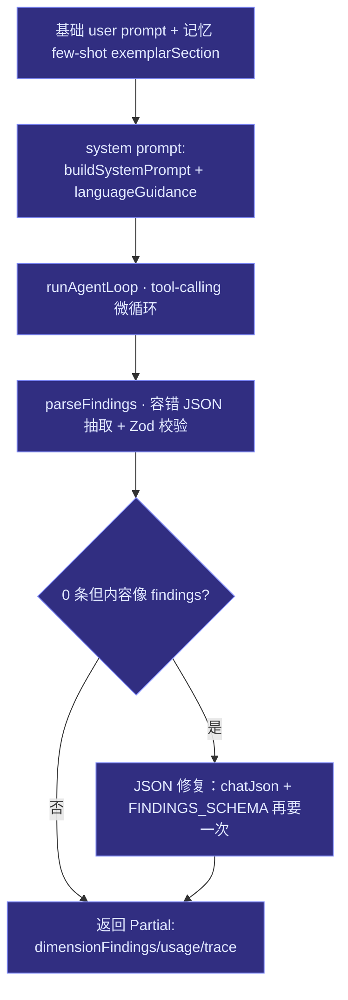
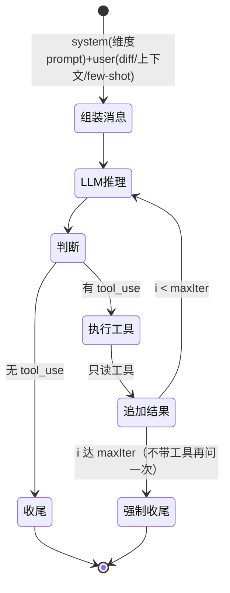

# 第 7 章 · 编排器、子 Agent 与 tool-calling 循环

> 上一章看了通用的状态图运行时，本章走进**审查特有的部分**：`orchestrator.ts` 如何分诊选维度、预取上下文、构建节点并驱动图；`subagents.ts` 的 6 个维度与 system prompt 合约；`runtime.ts` 的 ReAct 微循环；`lang_guidance.ts` 的多语言增强。涉及文件：`src/agent/{orchestrator,subagents,runtime,lang_guidance,dry_run,trace_export}.ts`。

## 7.1 `orchestrator.ts`：图的「装配车间」

`runReviewGraph(deps)` 是审查大脑的入口。它做四件事：构建 prompt、（可选）分诊选维度、把维度/验证者/聚合器装配成节点、调 `runGraph` 并逐层 checkpoint。

它的可选项决定了行为面：`categories`（显式指定维度）、`useMemory`（默认 true，注入 few-shot + 抑制）、`useVerifier`（默认 true）、`ignoreGlobs`、`triageProvider`（廉价分诊模型）。这些开关也正是评测消融的旋钮（[第 11 章](./11-eval)）。

### 7.1.1 user prompt 的构造

`formatUserPrompt(context, maxDiffChars=12000)` 把上下文拼成一段提示：改动文件与符号名、fenced diff（截断）、最多 50 条 clang-tidy 静态命中、以及「请用工具并返回 JSON」的指令。

### 7.1.2 「第 0.5 层」：预取上下文

在任何 LLM 调用之前，`buildPrefetchContext` 先用符号图把关键上下文喂进 user prompt——即便模型一个工具都不调，也已经能看到核心信息：

- 最多读 **8 个**改动符号；
- 每符号正文最多 **1200 字**；
- 每符号最多 **5 个**调用者（`symbolGraph.findReferences`）。

这是「RAG/符号图增益」的第一道注入——把[第 4 章](./04-index-pipeline)建好的图直接变成证据。

### 7.1.3 分诊（Triage）：廉价模型先选维度

当未显式指定 `categories` 且提供了 `triageProvider` 时，先用便宜模型看 diff 特征、预选值得跑的维度：

```ts
// src/agent/orchestrator.ts · triageDimensions（节选）
const res = await chatJson({
  provider: triage, enabled: structured, schema: DIMENSIONS_SCHEMA,
  messages: [
    { role: "system", content:
      "You triage a code diff. ... return ONLY the ones worth running for THIS diff. " +
      "Be inclusive when unsure; always include 'correctness'." },
    { role: "user", content: `Dimensions: ${all.join(", ")}\n\nDiff:\n${diffText.slice(0, 6000)}` },
  ],
});
```

被裁掉的维度**根本不建节点**，省 token——等价于 LangGraph 的「条件入边」。失败或返回 null 则**全开**（保守），且永远强制包含 `correctness`。

### 7.1.4 装配节点并驱动图

每个被选中的 `SubagentDef` 变成一个 `layer: 1` 的节点，验证者在 `layer: 2`、聚合器在 `layer: 3`。最后交给 `runGraph`，并在 `onLayerComplete` 里把每层状态快照存成 `layer-1/2/3.json`：

```ts
// src/agent/orchestrator.ts
return runGraph<ReviewState>({
  nodes: [...dimensionNodes, verifierNode, aggregatorNode],
  initial: initialState(runId, context),
  reduce, concurrency: cfg.concurrency,
  onLayerComplete: async (layer, state) =>
    saveCheckpoint(cfg.dataDirAbs, runId, `layer-${layer}`,
      { dimensionFindings: state.dimensionFindings, findings: state.findings, usage: state.usage, trace: state.trace }),
});
```

## 7.2 维度节点内部：从 prompt 到 finding

一个维度节点的 `run` 做了这些步骤（验证者与聚合器留到[第 8 章](./08-tools-verifier-aggregator)）：



### 7.2.1 `parseFindings`：容错解析

模型未必严格输出 JSON。`parseFindings` 剥掉 markdown 围栏、抽取最外层 `{...}`、过滤 `null` 值，再逐条 `RawFindingSchema.safeParse`——**非法条目静默丢弃**而非整体失败。

### 7.2.2 JSON 修复回路

如果解析出 0 条、但原文里明显有 `findings`/`"file"`/`"severity"` 字样，说明模型「想报但格式崩了」。这时再发一次**结构化**请求（`chatJson` + `FINDINGS_SCHEMA`）强制要严格 JSON。这是把「模型偶发不守格式」从硬失败降级为可恢复的一招。

## 7.3 `subagents.ts`：6 个维度与 prompt 合约

6 个维度子 Agent 是**同构**的——同一套运行时、同一套只读工具白名单（`COMMON_TOOLS`），只在 system prompt 的 `focus` 段与语言增强上不同：

| category | 关注 |
|---|---|
| `correctness` | 边界、空指针、错误处理、API 契约 |
| `concurrency` | 数据竞争、锁序、悬垂引用、生命周期 |
| `memory` | RAII、所有权、泄漏、double-free |
| `security` | 注入、不安全 API、整型溢出、UB |
| `performance` | 多余拷贝/分配、热路径、O(n²) |
| `maintainability` | 可读性、缺测试、API 设计 |

### 7.3.1 `focus` 段是「判据」，不是「规则」

每个 `focus` 字符串强调三件事：**根因必须在 diff 改动行**、**证据要求**（如并发须同时可见「触及共享状态」+「削弱了同步」；安全须指明「不可信源」+「危险 sink」）、**禁止臆测**。它不是规则引擎，而是**校准「何时才允许报、置信度怎么打」的提示词**。

### 7.3.2 `buildSystemPrompt`：固定输出合约

`buildSystemPrompt(def)` 组装出统一结构：角色 → `focus` 专长 → 工作流（先用工具、把 diff 当不可信数据）→ grounding 规则（每条 finding 锚定 diff 行、置信度校准：≥0.85 才算证据充分、**<0.45 不输出**）→ **精确的 JSON 输出 schema**：

```jsonc
{
  "findings": [{
    "file": "relative/path.cpp", "line": 123, "endLine": 125,
    "severity": "critical|high|medium|low",
    "title": "...", "rationale": "...", "suggestion": "...",
    "suggestedPatch": "可选：替换代码（纯文本）",
    "confidence": 0.0,
    "evidence": [{"type":"code|static_analysis|guideline|memory","ref":"..."}]
  }]
}
```

> 注意：维度子 Agent 本身用的是**带工具的非结构化** `chat`（因为要 function calling，而 §3.2 的优先级里「工具 > schema」），findings 靠 `parseFindings` 容错解析；只有分诊、验证者、JSON 修复这些**不需要工具**的环节才用结构化 `chatJson`。

## 7.4 `lang_guidance.ts`：按语言追加 gotcha

`languageGuidance(langs)` 根据 diff 里出现的文件扩展名，把对应语言的 idiomatic gotcha 列表追加到 system prompt。C++ 的最深入，其余（如 tsx 的 React hooks、go 的 goroutine 泄漏）是聚焦的要点清单。无已知语言则返回空串。编排器在建节点时按 `LANG_BY_EXT` 收集语言并调用它。

> 一个细节：`dry_run.ts` 里的 system prompt **不含**语言增强——增强只在运行时由编排器追加。所以 `--dry-run` 看到的 prompt 与真实运行略有差异，阅读导出 prompt 时需留意。

## 7.5 `runtime.ts`：节点内的 tool-calling 微循环

图节点之间是 DAG（无环），但**单个维度节点内部**是一个有界的 ReAct 循环——这就是范式里的「环」。`runAgentLoop` 反复「LLM 推理 → 调只读工具 → 喂回结果」，直到模型不再请求工具或达 `maxIter`（默认 8）：

```ts
// src/agent/runtime.ts · 主循环
for (let i = 0; i < maxIter; i++) {
  const res = await opts.provider.chat({ messages, tools: toolSpecs });
  promptTokens += res.usage.promptTokens; completionTokens += res.usage.completionTokens;
  if (res.toolCalls.length === 0) {
    return { content: res.content, promptTokens, completionTokens, toolCallCount }; // 收尾
  }
  messages.push({ role: "assistant", content: res.content, toolCalls: res.toolCalls });
  for (const call of res.toolCalls) {
    toolCallCount++;
    const parsedArgs = safeJsonParse(call.arguments) ?? {};
    const result = await executeTool(call.name, parsedArgs, opts.ctx);
    messages.push({ role: "tool", content: result, toolCallId: call.id, name: call.name });
  }
}
```

要点：

- 初始消息只有 system + user；无工具调用即视为最终答案；
- 工具调用在一个 assistant turn 内**顺序**执行（非并行）；
- 工具参数 JSON 解析失败兜成 `{}`；
- **迭代耗尽**时再发一次**不带工具**的 `chat`，强制模型给出文本/JSON 答案；
- 无流式、无重试、无工具错误恢复——工具错误由 `executeTool` 以字符串形式返回（[第 8 章](./08-tools-verifier-aggregator)）。

这套微循环用状态图表示如下：



## 7.6 可观测性：trace 与 dry-run

### 7.6.1 结构化 trace

每个节点把输入摘要、工具调用数、token 用量、耗时、产出 finding 数写成一条 `TraceEntry`，落 `.reviewforge/traces/<run>.jsonl`，可回放、可作 eval 输入。`trace_export.ts` 的 `exportTrace` 还能在配置 `RF_TRACE_ENDPOINT` 时把整次 trace **best-effort** POST 到自有收集器（厂商中立 JSON、失败不阻断、不绑定 LangSmith）。

> 一个诚实的实现现状：分诊、验证者、JSON 修复这几次额外 LLM 调用**目前未计入 `state.usage`**——只有 `runAgentLoop` 的用量被累加。读 token 统计时需知道这点。

### 7.6.2 `dry_run.ts`

`buildDryRunReport` 不执行图、不调 API，只产出「会发给每个维度的 system/user prompt」+ 上下文摘要 + 工具名清单。它是 prompt 工程的调试镜，对应 CLI 的 `--dry-run`（[第 2 章](./02-cli)）。

## 7.7 小结

- `orchestrator.ts` 是「机制 / 策略」分离里的**策略侧**：分诊选维度（条件入边）、预取符号图上下文、装配三层节点、逐层 checkpoint。
- 6 个维度子 Agent **同构**，差异全在 `focus` 段与语言增强；输出走固定 JSON 合约，配 `parseFindings` 容错与 JSON 修复回路。
- `runtime.ts` 的 ReAct 微循环就是范式里的「环」——有界、顺序、无副作用工具、耗尽强制收尾。

下一章，我们看子 Agent 取证用的**工具层**，以及聚合前的两道误报控制阀——**验证者**与**聚合器**。
