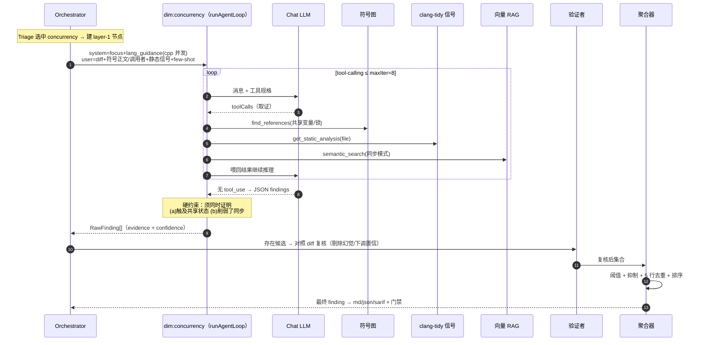

# 第 8 章 · 工具层、验证者与聚合器

> 本章覆盖三块：子 Agent 取证用的 `tools.ts`（10 个只读工具）、`structured.ts`（结构化输出与能力探测），以及聚合前的两道误报控制阀——验证者（在 `orchestrator.ts`）与 `aggregator.ts`。最后用一条 finding 的端到端旅程把全链路串起来。涉及文件：`src/agent/{tools,structured,aggregator,orchestrator}.ts`。

## 8.1 `tools.ts`：10 个只读工具

工具是子 Agent「下结论所需证据」的来源。全部**只读**——没有写文件、没有任意 shell。`ToolContext` 是共享依赖：`{ cfg, index, embed, review, memory }`。

| 工具 | 作用 | 实现要点 |
|---|---|---|
| `get_diff` | 取当前审查改动 | 全 diff（8k 截断）或按文件取 hunk |
| `read_file` | 读源码片段 | 输出带 `N\| ` 行号前缀 |
| `read_symbol` | 读某符号完整定义 | 符号图优先，回退到对提示文件 `extractSymbols`；支持 `qualifier` 消歧 |
| `find_definition` | 查符号定义位置 | `symbolGraph.findDefinition` |
| `find_references` | 查调用者/引用 | 调用图优先，回退 `ripgrep -w`；歧义时给 `qualifiersFor` 提示 |
| `search_code` | 关键词/正则检索 | `ripgrep` + 可选 glob |
| `semantic_search` | 向量语义检索 | 需 `index.hasVectors` + `embed`；返回 top-k chunk + 分数 |
| `get_static_analysis` | 取静态分析命中 | 来自 `review.staticFindings`，可按文件过滤 |
| `read_guidelines` | 读项目规范 | `review.guidelines.text` |
| `recall_memory` | 检索历史范例 | `memory.recall(query, { category, embed })`（[第 9 章](./09-memory)） |

### 8.1.1 工具是「降级友好」的

注意这些工具如何呼应前几章：`find_references` 优先走[第 4 章](./04-index-pipeline)的精确调用图、**ripgrep 兜底**；`semantic_search` 在无向量索引时直接不可用（而非崩溃）。工具本身也带兜底：`ripgrep` 不可用就退 `git grep`，再不行返回空串。

### 8.1.2 工具错误绝不抛进循环

`executeTool` 把一切异常变成**字符串结果**喂回模型，而不是抛给 `runtime.ts`：

```ts
// src/agent/tools.ts
export async function executeTool(name, args, ctx): Promise<string> {
  const tool = TOOL_MAP.get(name);
  if (!tool) return `ERROR: unknown tool ${name}`;
  try { return await tool.handler(args ?? {}, ctx); }
  catch (err) { return `ERROR running ${name}: ${(err as Error).message}`; }
}
```

这样模型能「看到」工具失败并自行调整，而不是让整个节点崩掉——又一处优雅降级。

## 8.2 `structured.ts`：结构化输出与能力探测

分诊、验证者、JSON 修复都需要**严格 JSON**。但不是所有端点都支持 `json_schema`。`chatJson` 实现了「探测 + 回退」：

```ts
// src/agent/structured.ts
const useSchema = enabled && !unsupportedModels.has(provider.model);
if (useSchema) {
  try { return await provider.chat({ messages, responseSchema: schema, temperature }); }
  catch (err) {
    if (looksLikeSchemaRejection(err)) {           // 400/404/422/501 或关键词
      unsupportedModels.add(provider.model);        // 记住该模型不支持
      log("falling back to json_object.");
    } else throw err;                               // 真故障（超时/鉴权/5xx）交上层
  }
}
return provider.chat({ messages, responseFormatJson: true, temperature }); // 回退 json_object
```

亮点：

- **进程级缓存** `unsupportedModels`：某模型一旦拒绝 schema，后续直接走 `json_object`，不再重试探测；
- 区分「schema 不被支持」（回退）与「真正的失败」（上抛）——避免把超时误判成「不支持 schema」。

它定义了三个 schema：`DIMENSIONS_SCHEMA`（分诊）、`FINDINGS_SCHEMA`（JSON 修复）、`VERDICTS_SCHEMA`（验证者）。OpenAI 严格模式要求所有属性进 `required`，可选字段用 nullable 联合表达。

## 8.3 验证者：误报的主控制阀

验证者是 `layer: 2` 的**条件节点**：仅当存在任何候选 finding 时才跑（`shouldRun`）。它把所有维度的候选打平、编号 `#0..#N`，连同 diff（12k）一次性发给模型，要求**逐条判断 diff 是否支持该结论**。

其 system prompt 的语气刻意保守：

```ts
// src/agent/orchestrator.ts · 验证者 system prompt（节选）
"You are a code-review verifier. ... ONLY drop findings that are clearly hallucinated, " +
"contradicted by the code, or about lines not in the diff. When in doubt, KEEP the finding " +
'(set keep=true) ... Respond with ONLY JSON: {"verdicts":[{"index":N,"keep":...,"confidence":...}]}.'
```

处理逻辑：

- 对每个 index：`keep=false` → 丢弃；`keep=true` 且带 `confidence` → 取 `min(原置信, 复核置信)`（**只下调不上调**）；
- 用复核后的集合**整体替换** `dimensionFindings`（[第 6 章](./06-state-graph)的 reducer 替换语义）；
- **失败即保留**：验证者调用出错或返回空 verdicts → 返回 `{}`，保留全部 finding 不变。

> 验证者的设计哲学是「**只删除明显噪声，不替模型二次质疑**」。它宁可漏删一个误报，也不愿误删一个真 bug——这与「保守 prompt 提精确率」的整体取向一致。

## 8.4 `aggregator.ts`：阈值、抑制、去重、排序

聚合器是 `layer: 3` 的终点。它把复核后的 raw findings 收敛成最终 `Finding[]`：


几个关键点：

- **三重过滤**：`confidence >= minConfidence`（`RF_MIN_CONFIDENCE` 默认 0.5）、不在长期记忆的误报抑制集、文件不命中 `.rfignore` glob（`globToRegExp`：`*`→`[^/]*`、`**`→`.*`）；
- **去重窗口 5 行**：多个子 Agent 常把**同一根因**换不同维度的措辞重复报告——同文件 5 行内的视为重复，保留排序后的第一条（critical 优先、置信高优先）；
- **抑制集来源**：编排器把 `memory.suppressedIds()` 传进来（[第 9 章](./09-memory)）。

## 8.5 端到端：一条 finding 的旅程

把[第 5–8 章](./05-review-preprocessing)串起来，以 `concurrency` 维度为例：



这条链上「**非纯 prompt**」的关键点：`find_references` 走 tree-sitter 符号图（精确调用关系，非 grep）、clang-tidy 命中作为结构化事实信号交叉印证、`semantic_search` 是向量 RAG，产出后还有验证者复核与聚合器抑制/去重两道关——这正是 ReviewForge 区别于「把 diff 丢给 LLM」的本质所在。

## 8.6 小结

- **10 个只读工具**把[第 4 章](./04-index-pipeline)的符号图与向量、[第 5 章](./05-review-preprocessing)的静态信号/规范、[第 9 章](./09-memory)的历史范例统统变成可按需取用的证据；工具错误以字符串回喂、绝不抛进循环。
- `structured.ts` 用「探测 + 进程级缓存 + 回退」优雅地兼容了不支持 `json_schema` 的端点。
- **验证者 + 聚合器**是误报治理的两道阀门：前者保守地删明显幻觉、只下调置信；后者做阈值、抑制、跨维度去重与排序。

下一章进入让审查「越用越准」的引擎——三层记忆与反馈闭环。
