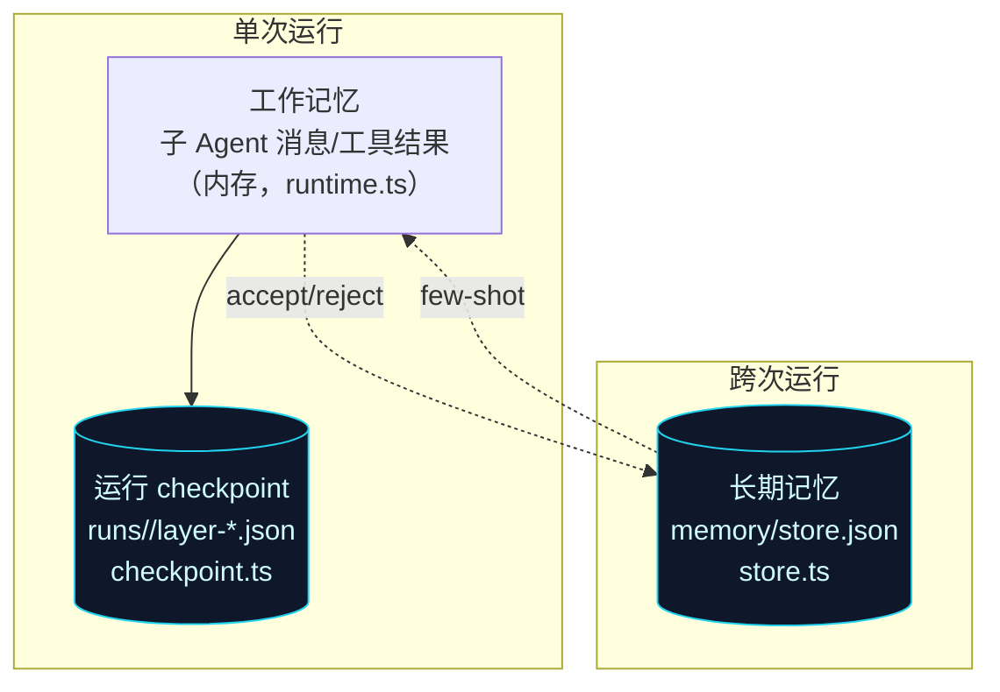

# 第 9 章 · 三层记忆与反馈闭环

> 本章拆解让审查「越用越准」的引擎：`memory/store.ts`（跨次运行的长期记忆）与 `memory/checkpoint.ts`（单次运行的逐层快照）。涉及文件：`src/memory/{store,checkpoint}.ts`。

## 9.1 三层记忆的全景

ReviewForge 的「记忆」是分层的，但要分清**两个不同的物理存储**：



| 层 | 内容 | 存储 | 生命周期 |
|---|---|---|---|
| **工作记忆** | 子 Agent 运行内的消息、工具结果、累积 findings | 内存 | 单次推理 |
| **运行 checkpoint** | 每层 `ReviewState` 快照 | `runs/<id>/layer-*.json` | 单次运行（可回放） |
| **长期反馈闭环** | 误报库 + bug 范例 + 仓库画像 | `memory/store.json` | 跨次累积 |

工作记忆已在[第 7 章](./07-orchestrator-subagents)的 `runtime.ts` 讲过；本章聚焦后两者。

## 9.2 `checkpoint.ts`：诊断用的逐层快照

非常薄的一层：`saveCheckpoint(dataDir, runId, node, state)` 把状态写到 `<dataDir>/runs/<runId>/<node>.json`。编排器在每层完成（`onLayerComplete`）时以 `layer-1/2/3` 调用它，存 `{ dimensionFindings, findings, usage, trace }`。

它用普通 `fs.writeFile`（**非原子**）——因为 checkpoint 是诊断/回放用的，不参与并发合并，无需原子性。这与长期记忆的原子写形成对比（见下）。

## 9.3 `store.ts`：长期记忆的「三个关注点」

长期记忆是一个 JSON 文件 `{ records: MemoryRecord[], profile: RepoProfile }`，但承载三个协作的关注点：

```ts
// src/memory/store.ts · 类注释道破设计
// - confirmed_bug records become few-shot exemplars (recall by embedding or keyword).
// - false_positive records suppress matching findings on future runs.
// - repo profile tracks hotspots / category distribution.
```

1. **已确认 bug 范例**（`confirmed_bug`）→ 作为 few-shot 注入相关维度（`exemplars` / `recall`）；
2. **误报指纹**（`false_positive`）→ 用稳定 finding ID 抑制（`suppressedIds` → 聚合器）；
3. **仓库画像**（`RepoProfile`）→ `fileHotspots` + `categoryCounts`，从已确认 bug 重算。

### 9.3.1 反馈入口：`recordFeedback`

`rf feedback <id> <verdict>`（[第 2 章](./02-cli)）最终落到这里：

- `accept` → 记为 `confirmed_bug`，可选嵌入向量；
- `reject` → 记为 `false_positive`（进抑制库）；
- `ignore` → no-op；
- 按 `finding.id` 替换同 ID 旧记录，并幂等地重算画像。

### 9.3.2 召回：`recall` 与 `exemplars`

`recall(query, opts)` 在记录带向量且提供 `embed` 时用**余弦相似度**召回，否则退化为**关键词重叠**（长度 > 3 的词）。`exemplars(category, k=2)` 取该维度的若干范例，由编排器拼进 user prompt（[第 7 章](./07-orchestrator-subagents)的 `exemplarSection`）。这就是「记忆 → few-shot」的注入路径。

### 9.3.3 稳定 ID 是闭环的关键

抑制与「替换同 ID 记录」都依赖 finding 的**稳定 ID**——它是 `SHA1(file:line:category:title)` 的前 12 位（在 `report/finding.ts`，[第 10 章](./10-report-sinks)）。同一个缺陷在多次审查里会得到同一个 ID，于是「标记一次误报 → 以后永久抑制」「GitHub 重贴去重」才成立。

## 9.4 并发安全：reload-merge 保存

最值得学习的工程点：`rf review`（可能在写 checkpoint）与 `rf feedback`（在写长期记忆）可能并发。`store.ts` 的 `save()` 用「**先重读磁盘 → 合并 → 原子写**」避免互相覆盖：

```ts
// src/memory/store.ts · save 的 reload-merge
async save(): Promise<void> {
  try {
    const onDisk = JSON.parse(await fs.readFile(this.file, "utf8")) as MemoryData;
    this.data = mergeMemory(
      { records: onDisk.records ?? [], profile: onDisk.profile ?? emptyProfile() },
      this.data,
    );
  } catch { /* 尚无存储 */ }
  await writeFileAtomic(this.file, JSON.stringify(this.data, null, 2));
}
```

`mergeMemory` 按 `id` 取并集、**新 `createdAt` 胜出**，并从合并结果重算画像。配合[第 3 章](./03-config-providers)的 `writeFileAtomic`，两个进程同时落盘也不会读到半截文件或丢记录。

## 9.5 小结

- 记忆分**单次**（工作记忆 + 逐层 checkpoint）与**跨次**（长期 `store.json`）两个物理层，职责与生命周期不同。
- 长期记忆把审查者的 `accept/reject` 转成 **few-shot 范例 + 误报抑制 + 仓库画像**，让审查随使用变准；一切以**稳定 finding ID** 为锚。
- `save()` 的 **reload-merge + 原子写**是并发安全的范本，而诊断用的 checkpoint 则刻意用更轻的非原子写。

下一章看审查结果如何变成人读/机读/CI 可用的输出，以及如何回贴到 GitHub/Gerrit。
