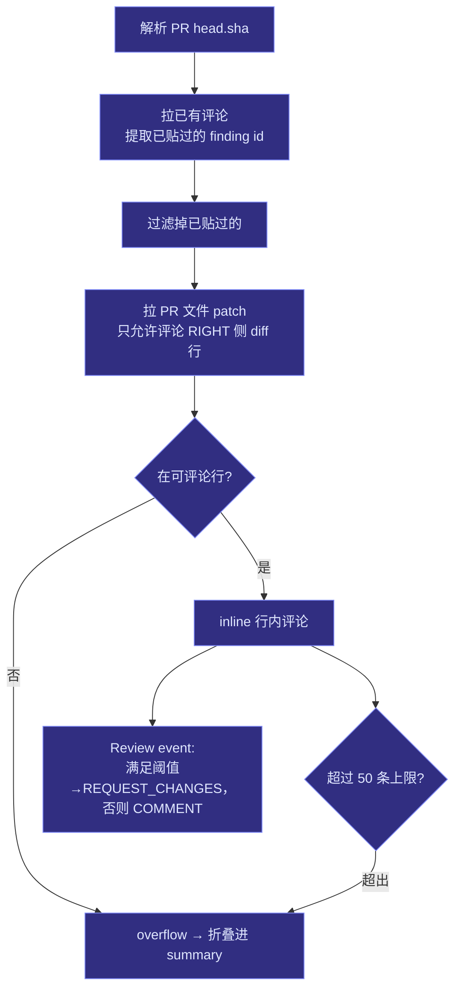

# 第 10 章 · 报告输出与平台对接

> 本章拆解 `src/report/`：Finding 数据模型与稳定 ID、Markdown / JSON / SARIF 三种渲染、退出码门禁，以及把审查回贴到 GitHub PR / Gerrit 的 sink。涉及文件：`src/report/{finding,markdown,json,sarif,gate}.ts` 与 `src/report/sinks/{types,factory,github,gerrit}.ts`。

## 10.1 `finding.ts`：贯穿全栈的数据模型

`finding.ts` 定义了从子 Agent 产出到最终输出的核心类型。`RawFindingSchema` 是 zod schema，给出必填/可选/默认：

```ts
// src/report/finding.ts
export const RawFindingSchema = z.object({
  file: z.string(),
  line: z.number().int().nonnegative(),
  endLine: z.number().int().nonnegative().optional(),
  severity: z.enum(SEVERITIES),                 // critical|high|medium|low
  title: z.string(),
  rationale: z.string(),
  suggestion: z.string().default(""),
  suggestedPatch: z.string().optional(),
  confidence: z.number().min(0).max(1).default(0.6),
  evidence: z.array(EvidenceSchema).default([]),
});
```

`Finding` 在此基础上加 `id` 与 `category`。两个细节值得记住：

**稳定 ID**（[第 9 章](./09-memory)反复用到）：

```ts
export function findingId(f: RawFinding, category: string): string {
  return crypto.createHash("sha1")
    .update(`${f.file}:${f.line}:${category}:${f.title}`).digest("hex").slice(0, 12);
}
```

**严重度排序方向**：`severityRank` 里 **0 = critical（最严重）**。这个「越小越严重」的约定被门禁、GitHub 的 request-changes 判断、Gerrit 的 unresolved 判断、以及所有排序统一复用——读这套代码时务必记住方向。

## 10.2 三种渲染：人读 / 机读 / 工具读

| 渲染 | 函数 | 受众 |
|---|---|---|
| Markdown | `renderMarkdown` | 人（CLI stdout、`review.md`） |
| JSON | `renderJson` | 程序（`review.json` 信封：`tool/version/generatedAt/findings`） |
| SARIF 2.1.0 | `renderSarif` | CI 工具链（GitHub code scanning / IDE） |

### 10.2.1 Markdown

按「严重度升序（critical 先）→ 置信度降序」排列，每条带位置范围、类别、置信度百分比、理由、建议；`suggestedPatch` 渲染成 GitHub 风格的 ` ```suggestion ` 块（可一键采纳），并附 evidence 列表。空结果输出成功提示。

### 10.2.2 SARIF 映射

`renderSarif` 把内部模型映射成业界标准 SARIF：

| ReviewForge | SARIF |
|---|---|
| `category` | `ruleId` + 驱动 `rules[]`（按类别去重） |
| `critical`/`high` | `level: "error"` |
| `medium` | `level: "warning"` |
| `low` | `level: "note"` |
| `title` + `rationale` | `message.text` |
| `confidence`/`severity` | `properties` |
| `file/line/endLine` | `locations[].physicalLocation`（行号 `Math.max(1, ...)` 钳制） |

## 10.3 `gate.ts`：CI 门禁的退出码

`computeExitCode` 是 CI 门禁的核心，只有几行，但语义要精确：

```ts
// src/report/gate.ts
export function computeExitCode(findings: Finding[], failOn: Severity | "none"): number {
  if (failOn === "none") return 0;
  const threshold = severityRank(failOn);
  const breach = findings.some((f) => severityRank(f.severity) <= threshold);
  return breach ? 2 : 0;
}
```

- 因为「rank 越小越严重」，`--fail-on high` 会在 **critical 和 high** 上都触发；
- 触发返回 **`2`**，而非 `1`——`1` 留给「贴评论失败」等 CLI 级错误（[第 2 章](./02-cli)）。这个区分让 CI 能分辨「审查发现了严重问题」与「工具本身出错」。

## 10.4 Sink 抽象：把审查贴回平台

`ReviewSink` 接口很简单——`post(findings, ctx) => Promise<PostResult>`。`factory.ts` 的 `buildSink` 按名字（`github`/`gerrit`）+ 环境变量构造对应 sink，缺配置则抛 `SinkConfigError`（`--dry-run` 时用占位符桩值放行）。

### 10.4.1 GitHub sink：diff-aware + 去重

`GitHubReviewSink` 是两个 sink 里更精细的。它的 `post` 流程：



关键工程点：

- **最多 50 条行内评论**、body 60k 字上限；
- **去重**：通过正则从历史评论里提取已贴过的 finding id（评论里嵌 `finding id: \`...\``），跳过重复——这正是稳定 ID 的用武之地；
- **diff-aware**：只在 PR diff 的 RIGHT 侧可评论行上贴 inline，其余折叠进汇总评论，避免 GitHub API 拒绝「不在 diff 上的行」；
- 满足 `GITHUB_REQUEST_CHANGES_ON` 严重度则发 `REQUEST_CHANGES`，否则 `COMMENT`。

### 10.4.2 Gerrit sink

`GerritReviewSink` 用 HTTP Basic 认证、`/a` 认证路径、剥离 XSSI 前缀 `)]}'`，POST 到 `/changes/{id}/revisions/{rev}/review`，payload 把 finding 按文件分组成行内 `comments`，严重度 ≤ high 标 `unresolved: true`，带 `tag: "autogenerated:reviewforge"`。与 GitHub 不同，**它不做去重/diff 过滤**——所有 finding 都尝试行内贴。

## 10.5 小结

- `finding.ts` 是贯穿全栈的数据模型；**稳定 ID** 支撑记忆抑制与 GitHub 去重，**严重度方向（0=critical）**被所有判断统一复用。
- 三种渲染各司其职：Markdown 给人、JSON 给程序、SARIF 给 CI 工具链；门禁用退出码 `2`/`0` 表达「是否触发」，与 CLI 错误码 `1` 区分。
- GitHub sink 的 **diff-aware + 历史去重** 是「能在真实 PR 上反复跑而不刷屏」的关键；Gerrit sink 则更直接。

下一章进入最后一块硬骨头：用可复现的指标，证明前面这些组件到底有没有用。
