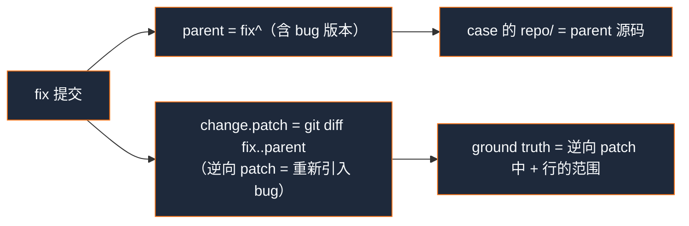

# 第 11 章 · 可量化评测体系

> 一个 AI 审查工具的可信度，取决于它能否用**可复现的指标**证明每个组件的增益。本章拆解 `src/eval/`：「修复的逆操作」式标注、缺陷组级匹配、消融阶梯、Student's t 置信区间、回归门禁与 LLM-as-Judge。涉及文件：`src/eval/{types,bench,runner,metrics,ablation,report,dashboard,regression,judge,seed}.ts`。

## 11.1 数据流

```
benchmarks/cases/*/case.json
   ↓ loadCases() [bench.ts]
LoadedCase[]
   ↓ runCase() × case × config × run [runner.ts]
CaseRunResult { metrics, findings, judge? }
   ↓ summarize() [report.ts]
AblationRun[] → report.md / report.json / dashboard.html
   ↓ checkRegression() vs baseline [regression.ts]（可选）
回归即 exit 3
```

## 11.2 基准 case 的格式

每个 case 是 `benchmarks/cases/<id>/` 下的一个目录：

```
cases/<id>/
  case.json        # 元数据 + ground truth
  change.patch     # （diffFile 模式）被审查的 patch
  repo/            # （repo: "repo"）父提交/含 bug 的源码树
```

`case.json` 的 schema（`types.ts`，zod 校验）关键字段：`id`、`repo`、三选一的 diff 源（`diffFile`/`base`/`commits`）、`groundTruth[]`（带 `file/line/endLine/category/severity`）、`labelSource`（`real|synthetic|negative`）、可选 `seed` 溯源。

`labelSource` 的语义很重要：

- **synthetic**：手工注入的 bug，标签精确；
- **real**：来自真实 fix 提交（见下「修复的逆操作」）；
- **negative**：干净改动，**任何 finding 都算误报**（空 GT → recall 记为 1、precision 受罚）。

## 11.3 `seed.ts`：「修复的逆操作」式标注

如何低成本地造出**带标注的真实 bug**？ReviewForge 的答案是把任意 bugfix 提交反过来用：



也就是：**父提交即「含 bug 版本」，fix 的逆操作即被审查的 PR，修复触及的行即 ground truth**。`generateCaseFromCommit` 还会从 commit message 推断 category（正则匹配 `concurrency/memory/security/...`）与 severity，并过滤测试目录与非源码文件。`findFixCommits` 能批量从 `git log --grep` 里挑出小改动的 fix 提交来播种。

> 这套方法的取舍（[第 1 章](./01-overview)已提）：ground truth 只覆盖「修复触及的行」，可能漏标 bug 的其他相关行——但它把「造标注数据」从昂贵的人工标注变成了一条命令。

## 11.4 `metrics.ts`：缺陷组级匹配

这是评测里最需要小心的部分。朴素地「一条 GT 一条 finding」会**冤枉**审查器——一个多 hunk 的修复常被标成 N 条 GT，但审查器只要在任一 hunk 附近报一次就该算对。`matchCase` 用**缺陷组（defect group）**解决：

- **行容差** `LINE_TOLERANCE = 3`：finding 行号在某 GT 范围 ±3 内即「near」；
- **缺陷合并**（默认开）：同 `(file, category)` 的多条 GT 合并成一个组，**recall/FN 在组级别衡量**——一条 finding 命中组内任一 hunk 即满足整组；
- **类别感知**（默认开）：GT 有 category 时，finding 的 category 必须匹配；
- **定位准确率**：对每组第一条命中的 finding，若行号**恰好落在** GT 范围内（而非仅 near）则计入 `localized`。

```ts
// src/eval/metrics.ts · TP/FP/FN 定义
const truePositives  = usedGroup.size;                       // 命中的缺陷组数
const falsePositives = findings.length - matchedFindingIds.length; // 没命中任何组的 finding
const falseNegatives = groups.length - usedGroup.size;       // 没被命中的组
```

聚合公式（`aggregateMetrics`，跨 case 池化 TP/FP/FN）：Recall=`tp/(tp+fn)`、Precision=`tp/(tp+fp)`、F1、FP/case、Localization=`localized/tp`，并对各种零分母做了合理的边界处理。

## 11.5 `ablation.ts`：消融阶梯

消融用「每行加一个能力」的阶梯，隔离每个组件的增益：

| 配置 | Index(RAG) | 静态分析 | 记忆 | 验证者 |
|---|---|---|---|---|
| `B-llm-only` | ✗ | ✗ | ✗ | ✗ |
| `+rag` | ✓ | ✗ | ✗ | ✗ |
| `+static` | ✓ | ✓ | ✗ | ✗ |
| `+verifier` | ✓ | ✓ | ✗ | ✓ |
| `full` | ✓ | ✓ | ✓ | ✓ |

这些布尔位直接连到[第 7 章](./07-orchestrator-subagents)的编排器开关（`useIndex` 决定是否加载索引/给 `embed`、`useStatic` 决定 `skipStatic`、`useMemory`/`useVerifier` 透传）。`runner.ts` 在三重循环（config × run × case）里逐一执行。

## 11.6 `metrics.ts` 的统计严谨性：Student's t 置信区间

单次 LLM 运行方差很大，所以多次 `--runs N` 后必须给**置信区间**而非裸均值。`describe` 用 **Student's t**（不是 z=1.96），因为评测重复次数小（通常 3–5）：

```ts
// src/eval/metrics.ts · describe（节选）
const variance = samples.reduce((acc, x) => acc + (x - mean) ** 2, 0) / Math.max(1, n - 1); // Bessel
const std = Math.sqrt(variance);
const sem = n > 1 ? std / Math.sqrt(n) : 0;
const ci95 = n > 1 ? tCritical95(n - 1) * sem : 0;   // 查 t 表，df>30 回落 1.96
```

报告里展示成 `mean ± ci95`。这种「诚实地承认方差」的态度，是把评测从「跑一次截图」提升到「可信对比」的关键。

## 11.7 `regression.ts`：回归门禁

`checkRegression` 把当前 `full` 配置与基线 `report.json` 对比：recall/precision/F1 跌超过 `metricDrop`（默认 5pp）算回归，FP/case 涨超过 `fpIncrease`（默认 1.0）算回归。任一回归 → `ok=false`，CLI 置 `process.exitCode = 3`。这让评测能进 CI、守住质量不倒退（项目自带 `.github/workflows/eval.yml`）。

## 11.8 `judge.ts`：LLM-as-Judge

`--judge` 启用一个**独立模型**对每条 finding 打分（无需 ground truth）：要求比原审查者更严格，逐条给 `valid` 与 `score(0–1)`。未被点名的 finding 默认「未评判但保留」（score 0.5）。它与 GT 匹配互补——一个看「有没有命中已知 bug」，一个看「报出来的 finding 质量如何」。

> 实现现状：judge 结果目前**计算但未写进报告输出**（报告只用 GT 指标）。读代码时会注意到这个「已搭好但未接线」的钩子。

## 11.9 `report.ts` 与 `dashboard.ts`

`renderEvalMarkdown` 产出消融对比表（多 run 时带 95% CI）、每 run 明细、按语言分桶、每 case 明细。`renderDashboard` 生成**自包含 HTML**（Chart.js from CDN，无构建步骤）：KPI 卡取最佳 F1 配置、Recall/Precision/F1 与 FP/case 柱状图、每配置 case 表、多 run 明细——`dashboard.html` 直接浏览器打开即可。

## 11.10 小结

- **「修复的逆操作」**把任意 bugfix 变成带标注 case，解决了「真实 bug 数据稀缺」；
- **缺陷组级匹配**避免冤枉多 hunk 修复，TP/FP/FN 在「组/finding」两个粒度上分别度量；
- **Student's t 置信区间 + 回归门禁 + 消融阶梯 + LLM-as-Judge** 构成一套诚实、可复现、可进 CI 的评测体系——这正是 ReviewForge 敢于和商业产品对标的底气。

最后一章，我们把所有模块收束成一张全局图，复盘贯穿全项目的设计哲学。
