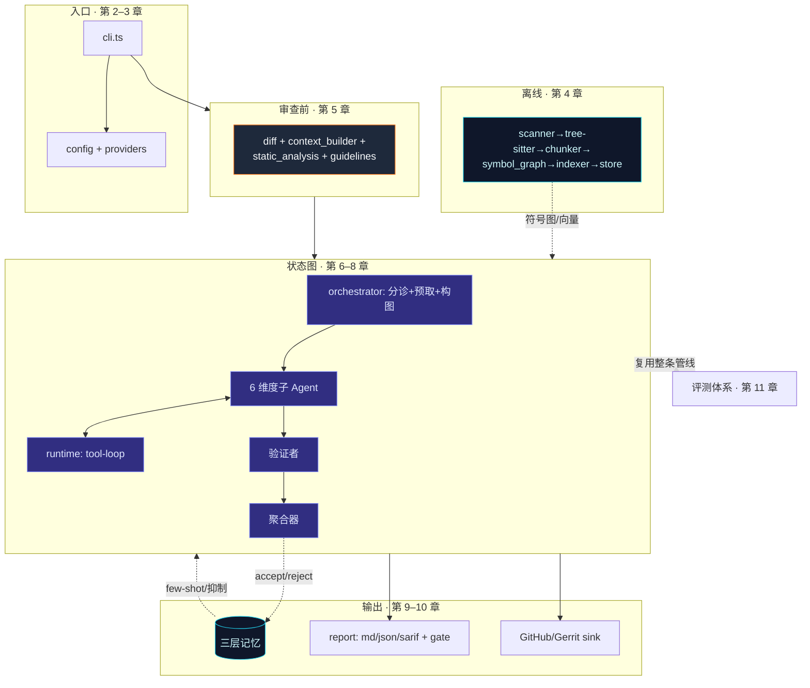

# 第 12 章 · 全局回顾与设计哲学

> 走完十一章，我们已逐文件拆过 ReviewForge 的每一层。本章把它们收束成一张全局图，并复盘贯穿整个项目的工程哲学——这些「为什么这么写」往往比「写了什么」更值得带走。

## 12.1 一张图回顾全栈

把它读成一句话：**离线把仓库变成可检索的符号图与向量；在线把 diff 富化成上下文，交给一张分层状态图并行深挖、复核、聚合；结果既产报告/门禁/PR 评论，又回流记忆让下次更准；整条管线被评测体系完整复用以量化每个组件的增益。**

## 12.2 贯穿全书的七条设计哲学

### 1. 失败即降级，绝不阻塞主流程

这是出现频率最高的模式：无嵌入 → 退化为符号图 + 关键词；无 clang-tidy → 跳过；维度节点抛错 → 兜成空、不中断整层；验证者失败 → 保留全部 finding；trace 上报失败 → best-effort。把 demo 变成生产工具的，正是这些「兜底」。

### 2. 机制与策略分离

通用的 `runGraph`（约 70 行、泛型、不懂审查）与审查特有的拓扑（在 `orchestrator.ts` 以数据声明）彻底解耦。运行时极稳，拓扑可随需求自由演化——增删一层只改 `layer` 字段。

### 3. 显式实现范式，而非 import 框架

不引入 LangGraph，却完整落地了「节点 / 类型化状态 / reducer / 条件路由 / 并行扇入扇出 / checkpoint / 错误隔离」。换来最轻依赖、最大控制力，以及对原理的透彻理解。

### 4. 双脑融合：让 LLM 与确定性工具互补

LLM 懂语义但会幻觉，静态分析精确但不懂意图。ReviewForge 让二者在改动行附近交叉印证——「LLM 解释 + 工具佐证 → 高置信」，并用符号图/向量 RAG 提供全仓库上下文。这是它区别于「把 diff 丢给 LLM」的根本。

### 5. 多道阀门治理误报

误报是审查工具的生命线。ReviewForge 设了**四道**：维度 prompt 的硬约束（必须满足前置条件才报）、验证者的 diff 复核、聚合器的阈值/抑制/去重、以及长期记忆的误报指纹库。保守的取向用一点召回换高精确率。

### 6. 处处防御真实世界的怪癖

`Object.create(null)` 防原型污染、嵌入空串/零向量兜底、原子写防并发撕裂、Gerrit `FETCH_HEAD` 陷阱、PowerShell 解包单对象的兼容、增量审查遇 rebase 回退全量……这些细节是「读源码涨经验」的金矿。

### 7. 用可复现的指标说话

「修复的逆操作」标注 + 缺陷组级匹配 + Student's t 置信区间 + 消融阶梯 + 回归门禁。不只跑一次截图，而是诚实地承认方差、可复现、可进 CI。

## 12.3 哪些是有意识的「非目标」

读懂一个系统，也要读懂它**刻意不做**什么：

- 无 LSP/clangd 集成、无完整跨文件 import 解析图（只做别名归一）；
- 向量检索是暴力余弦、无 ANN 索引（中小仓库足够，超大仓库再换）；
- 启发式解析仅 C/C++；其余无 tree-sitter 支持的语言只能拿到空符号 + 窗口分块；
- 文件系统**只读**，无写文件/任意 shell 工具——安全基线；
- judge 结果已计算但未接进报告、几次辅助 LLM 调用未计入 usage——诚实记录的「现状」。

这些边界都是清醒的工程取舍，而非疏漏。

## 12.4 这套架构能教给我们什么

ReviewForge 最大的价值，或许不在「它是一个好用的审查工具」，而在于它是一份**生产级 AI Agent 工程的完整范本**：

- 如何把一个看似「调 LLM」的任务，分解成可并行、可复核、可聚合的 map-reduce 图；
- 如何在不绑定框架的前提下，自己实现一套清晰可控的编排范式；
- 如何用 RAG + 符号图 + 静态分析把 LLM **锚定**在事实上，而非任其幻觉；
- 如何用反馈闭环让系统越用越准；
- 以及最重要的——如何用可复现的评测，**证明**上面每一项到底有没有用。

如果你正在构建自己的 Agent，这十一章里反复出现的那些「为什么」，比任何单个文件的实现都更值得借鉴。

---

> 至此，《ReviewForge 源码解析》全部章节结束。建议对照源码二次阅读，所有结论都标注了对应文件，便于你顺藤摸瓜。
