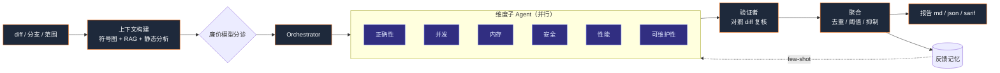

# ReviewForge — 项目综述

  

一个面向 C++/系统代码（并支持多语言）的多 Agent AI 代码审查系统：既是一个能真正使用的工具，
也是一次「生产级 AI Agent 工程」的完整演示。

## 问题

人工代码审查是瓶颈，且容易漏掉 C++ 的深层缺陷（数据竞争、生命周期 / RAII、ABI、未定义行为）。
现有两类工具各有缺陷：**静态分析器**（clang-tidy）精确但噪声大、不懂语义；**通用 LLM 审查**
懂意图，却只看 diff，因而容易幻觉、爱挑无关紧要的小毛病。ReviewForge 把两者**融合**，锚定在
**全仓库上下文**之上，并配套一套**可量化的评测体系**。

## 架构（手写状态图）

  

`diff → 上下文（tree-sitter 符号图 + 向量 RAG + 静态分析信号）→ 分诊 →
Orchestrator → 6 个维度子 Agent（并行）→ 验证者 → 聚合器 → 报告 / PR 评论`

- **不依赖 LangChain / LangGraph** —— 编排是手写的有状态图（类型化共享状态、reducer、条件路由、
  并行扇入扇出、checkpoint、节点级错误隔离）。意在**演示这套范式本身**，而非直接 import 一个框架。
- **tree-sitter** 跨 C / C++ / TS / JS / Python / Go / Rust / Java 抽取符号 + 调用图。
- **验证者子 Agent** 对每条候选 finding 对照 diff 二次核验（「假设 → 验证」，呼应 X16/X17 capstone 设计），
  这是压制误报的主要手段。
- **三层记忆** 把审查者的反馈（accept/reject）转化为 few-shot 范例、误报抑制与仓库热点画像 ——
  审查随使用越来越准。

## 关键工程决策 / 取舍

| 决策 | 原因 | 取舍 |
|---|---|---|
| 手写状态图 vs LangGraph | 控制力、透明度、更轻依赖、对原理理解更深 | 需自己实现部分管线 |
| tree-sitter（WASM）vs clang AST | 可移植、多语言、无需编译环境 | 不如真编译器精确 → 由 clang-tidy 补足 |
| 锁定 `web-tree-sitter` 0.22.6 | grammar wasm 的 ABI 兼容性（0.26 dylink 失败） | API 较旧 |
| 内存暴力向量检索（MVP） | 零依赖，对此规模仓库 <10ms | 不适合百万级 chunk |
| 「修复的逆操作」式基准标注 | 能把任意 bugfix 提交变成带标注的 case | ground truth 只覆盖修复触及的行 |
| category-agnostic vs -aware 指标 | 审查者常把同一根因换不同维度表述 | 两种口径都报 |

## 评测

用**「修复的逆操作」方法**构建真实 bug 基准（fix 提交的父提交即「含 bug 版本」，逆向 patch 即被审查的 PR，
ground truth = 修复触及的行）。case 自动从内部专有 C++ 代码库与公开仓库（spdlog C++、gjson Go）生成，
另加合成负样本。评测 harness 支持**消融阶梯**（仅 LLM → +RAG → +静态分析 → +验证者 → full）、
**多次运行 mean±std**、**LLM-as-Judge**、**按语言分桶**，以及对照基线报告的**回归门禁**。

**核心结果（3 个内部代码库的真实 C++ bug，reviewer 视角口径，prompt 调优后）：**
Recall 87.5% · Precision 77.8% · F1 82.4% · FP 0.67/PR · 100% 行号定位 ——
相对未调优基线 F1 提升 2.5×、误报降低 11.5×（见 `benchmarks/results/`）。

> 可从本仓库复现的公开子集结果见 [`benchmarks/results-public/`](../benchmarks/results-public/)；上面 3 个内部 case
> 基于专有代码，**不可公开复现**，数字仅作定性参考。

**诚实的注意事项：** 单次 LLM 运行方差会主导小样本消融（请用 `--runs N`）；clang-tidy 在真实项目上需要
compile DB；偏保守的 prompt 用一部分召回换精确率（可通过 `min_confidence` 与阈值调节）。

## 真实世界演示

在一个真实 GitHub PR 上端到端跑通：clone 一个公开仓库，开一个重新引入已知 bug 的 PR，跑
`rf index` + `rf review`，并**贴出了一条真实的行内审查评论**（带可一键采纳的 GitHub `suggestion`）。
同一套机制也能贴到 Gerrit。

## 工程规模

约 5k 行 TypeScript，77 个单元测试，全量类型检查。CLI（`index`/`review`/`eval`/`feedback`/`post`/
`doctor`），GitHub Actions 模板（审查 + 自身 CI），SARIF 输出，可 `npm` 全局安装的 `rf`。

## 后续计划

结构化（function-calling）finding 输出；更大规模、带置信区间的多语言基准；更丰富的调用图
（跨文件类型解析）；增量式 PR-update 审查；LangSmith 式的托管 tracing。
