# ReviewForge — Project Writeup

  

A multi-agent AI code-review system for C++/systems code (with multi-language support),
built to be both a real tool and a demonstration of production AI-agent engineering.

## Problem

Manual code review is a bottleneck and misses deep C++ bugs (data races, lifetime/RAII,
ABI, UB). Two existing tool classes are each incomplete: **static analyzers** (clang-tidy) are
precise but noisy and semantics-blind; **generic LLM reviewers** understand intent but only see
the diff, so they hallucinate and nitpick. ReviewForge fuses both, grounded in whole-repository
context, with a measurable evaluation harness.

## Architecture (hand-rolled state graph)

  

`diff → context (tree-sitter symbol graph + vector RAG + static-analysis signals) → triage →
orchestrator → 6 dimension subagents (parallel) → verifier → aggregator → report / PR comments`

```mermaid
flowchart LR
    diff["diff / branch / range"] --> ctx["context build<br/>symbol graph + RAG + static analysis"]
    ctx --> triage{"cheap-model triage"}
    triage --> orch["orchestrator"]
    subgraph dims["dimension subagents (parallel)"]
      direction TB
      d1["correctness"]
      d2["concurrency"]
      d3["memory"]
      d4["security"]
      d5["performance"]
      d6["maintainability"]
    end
    orch --> dims --> verify["verifier<br/>re-check vs diff"]
    verify --> agg["aggregate<br/>dedupe / threshold / suppress"]
    agg --> out["report md / json / sarif"]
    agg --> mem[("feedback memory")]
    mem -.few-shot.-> dims

    classDef stage fill:#1e293b,stroke:#f97316,color:#f8fafc;
    classDef agent fill:#312e81,stroke:#818cf8,color:#e0e7ff;
    class diff,ctx,orch,verify,agg,out stage;
    class d1,d2,d3,d4,d5,d6 agent;
```

- **No LangChain/LangGraph dependency** — the orchestration is a hand-written stateful graph
  (typed shared state, reducer, conditional routing, parallel fan-in/fan-out, checkpointing,
  per-node error isolation). This demonstrates the pattern rather than importing it.
- **tree-sitter** extracts symbols + a call graph across C/C++/TS/JS/Python/Go/Rust/Java.
- **Verifier subagent** re-checks every candidate finding against the diff (hypothesis→verify,
  per the X16/X17 capstone designs), which is the main false-positive lever.
- **Three-tier memory** turns reviewer feedback (accept/reject) into few-shot exemplars,
  false-positive suppression, and a repo hotspot profile — the review improves with use.

## Key engineering decisions / tradeoffs

| Decision | Why | Tradeoff |
|---|---|---|
| Hand-rolled graph vs LangGraph | control, transparency, lighter deps, deeper understanding | reimplement some plumbing |
| tree-sitter (WASM) vs clang AST | portable, multi-language, no compile env | less precise than a real compiler → clang-tidy complements it |
| Pin `web-tree-sitter` 0.22.6 | grammar wasm ABI compatibility (0.26 failed dylink) | older API |
| In-memory brute-force vectors (MVP) | zero-dep, <10ms for repos this size | not for millions of chunks |
| Inverse-of-fix benchmark labeling | turns any bugfix commit into a labeled case | GT only covers fix-touched lines |
| Category-agnostic vs -aware metrics | reviewers reframe the same root cause across dimensions | report both |

## Evaluation

Benchmark of real bugs built by the **inverse-of-fix** method (a fix commit's parent is the
"buggy" version; the inverse patch is the PR under review; ground truth = the fix-touched lines).
Cases auto-generated from an internal proprietary C++ codebase and public repos (spdlog C++, gjson Go),
plus synthetic negatives. Harness supports an **ablation ladder** (LLM-only → +RAG → +static →
+verifier → full), **multi-run mean±std**, **LLM-as-Judge**, **per-language breakdown**, and a
**regression gate** vs a baseline report.

**Headline result (3 real C++ bugs from an internal codebase, reviewer-view metric, after prompt tuning):**
Recall 87.5% · Precision 77.8% · F1 82.4% · FP 0.67/PR · 100% line localization —
F1 ×2.5 and FP ×11.5↓ vs the untuned baseline (see `benchmarks/results/`).

**Honest caveats:** single-run LLM variance dominates small-sample ablations (use `--runs N`);
clang-tidy needs a compile DB on real projects; the conservative prompts trade some recall for
precision (tunable via `min_confidence` + thresholds).

## Real-world demonstration

End-to-end on a real GitHub PR: cloned a public repo, opened a PR that re-introduces a known
bug, ran `rf index` + `rf review`, and **posted a real inline review comment** (with a one-click
GitHub `suggestion`). The same machinery posts to Gerrit.

## Engineering surface

~5k LOC TypeScript, 77 unit tests, typechecked. CLI (`index`/`review`/`eval`/`feedback`/`post`/
`doctor`), GitHub Actions templates (review + self-CI), SARIF output, npm-installable global `rf`.

## What I'd do next

Structured (function-calling) finding output; larger multi-language benchmark with confidence
intervals; richer call-graph (cross-file type resolution); incremental PR-update reviews;
LangSmith-style hosted tracing.
